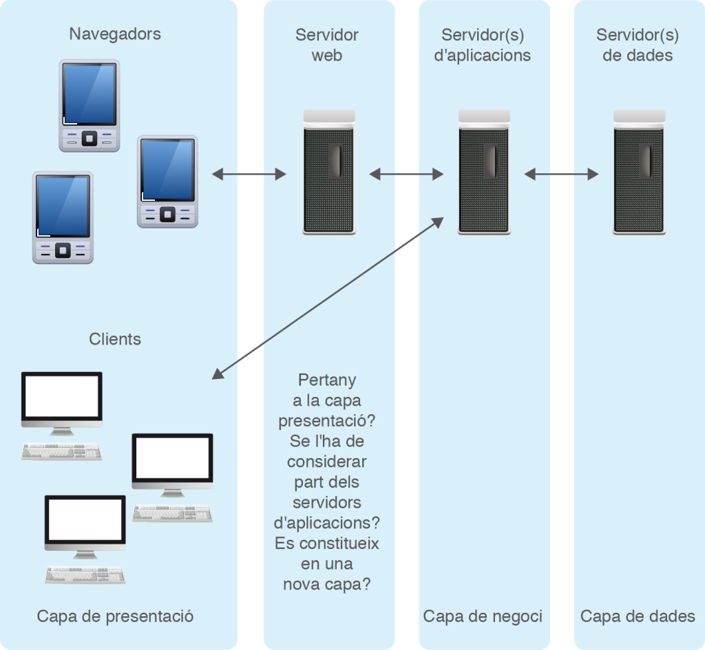
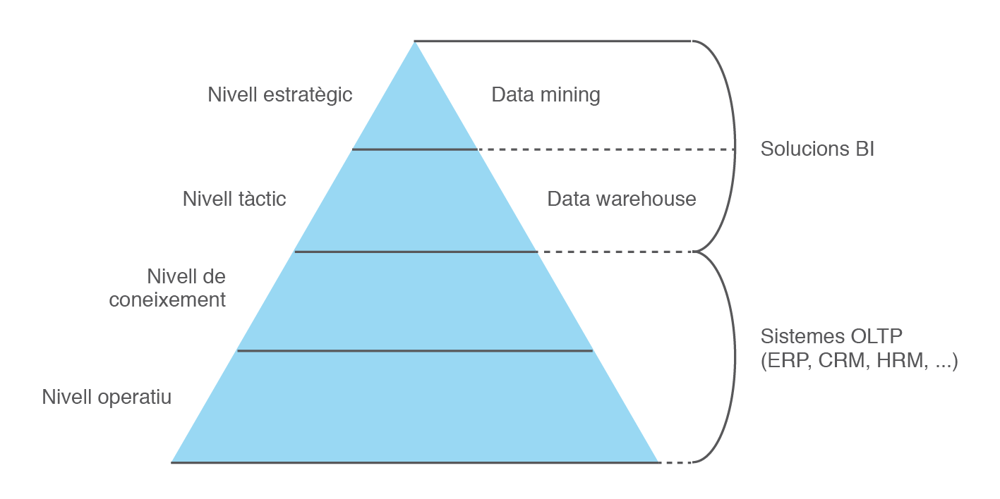
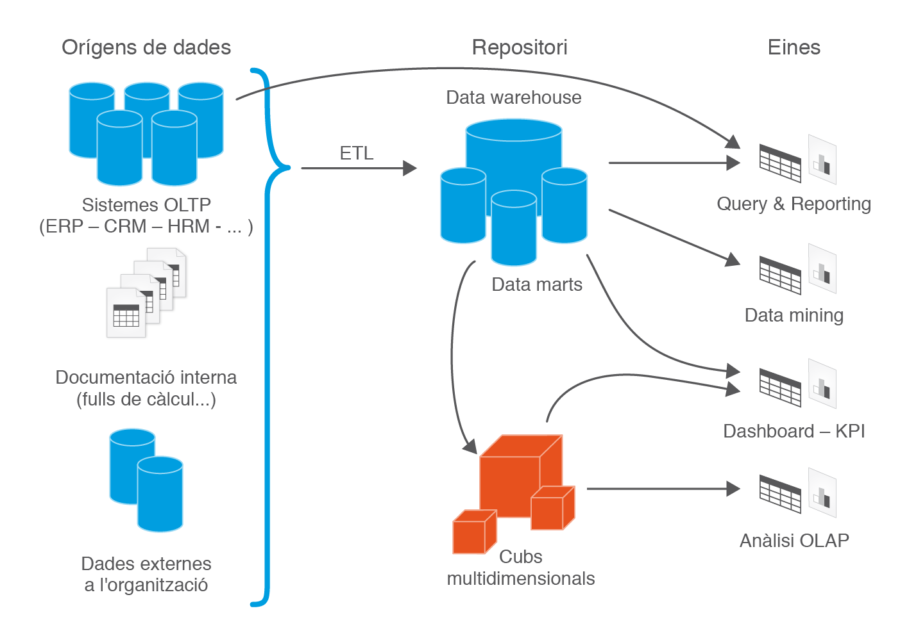
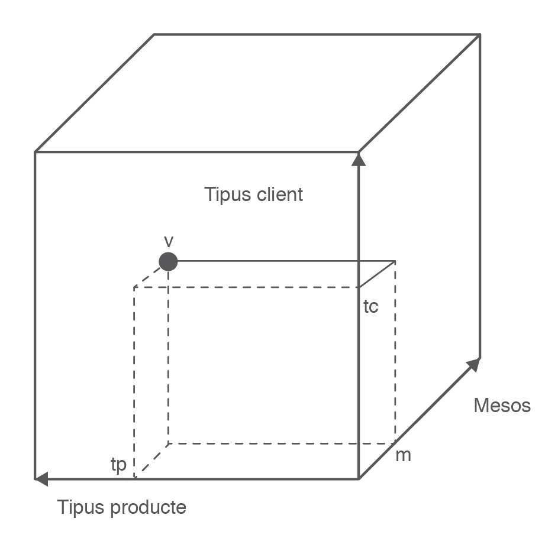

# 1.  Identificació de sistemes ERP-CRM i solucions BI

Les empreses necessiten, per a una òptima gestió empresarial, un suport  informàtic adequat a les necessitats de l’empresa. Per aquest motiu hi  ha en el mercat diversos programes informàtics: gestió comercial,  compravenda, facturació, comptabilitat, nòmines, producció, relació amb  els clients… molts d’ells englobats en paquets que es distribuïxen com a unitats o de forma modular.

Els **sistemes ERP**, de l’anglès *Enterprise Resource Planning*, coneguts àmpliament com a sistemes de planificació de recursos  empresarials, són sistemes que integren o pretenen integrar totes les  dades i processos d’una organització en un sistema unificat. Aquesta  definició pot portar a confondre els ERP amb els paquets comercials que  engloben diversos programes. És important conèixer la frontera entre  els diferents tipus de productes.

Els **sistemes CRM**, de l’anglès *Customer Relationship Management*, coneguts com a sistemes de gestió de la relació amb els clients, són  sistemes que donen suport a la gestió de les relacions amb els clients, a la venda i al màrqueting.

Les **solucions BI**, de l’anglès *Business Intelligence*, conegudes com a solucions d’intel·ligència de negoci o solucions  d’intel·ligència empresarial, són un conjunt d’eines destinades a  facilitar dades als dirigents empresarials, obtingudes a partir de les  dades dels sistemes ERP-CRM, amb l’objectiu d’ajudar a la presa de  decisions. El ventall de solucions BI és ampli: des d’eines d’elaboració d’informes fins a sofisticades eines de gestió de cubs OLAP.

Abans de fer la instal·lació, configuració, explotació i adequació de sistemes ERP-CRM i solucions BI, ens convé conèixer:

1.  Els tipus de llicenciament actuals.
2.  Els tipus de desplegament (implantacions) actuals i requisits associats.
3.  Les funcionalitats normalment proporcionades per les aplicacions ERP/CRM/BI.
4.  Els principals productes existents en el mercat.

## 1.1 Llicències de programari

En el mercat actual trobem un gran nombre d’aplicacions que poden tenir  utilitat a les empreses. Totes elles van acompanyades d’un determinat  tipus de llicència. Per altra banda, ha proliferat un gran nombre de  tipus de llicències de programari. En conseqüència, ens cal poder  reconèixer la llicència que acompanya cada programari i les seues  implicacions.

`Una llicència de programari és l’autorització o permís concedit pels autors del programari per poder-lo utilitzar, baix uns drets i deures.`

El nostre objectiu no és conèixer l’evolució que han tingut els conceptes programari lliure i programari privatiu, sinó conèixer els conceptes existents i utilitzats en el moment actual.

Pel que fa al programari lliure, ens cal saber que, segons la Free Software Foundation, un programari és lliure quan garanteix les **quatre llibertats** següents (enumerades a partir del valor zero); davant d’aquesta definició, qualsevol programari que violi alguna de les quatre llibertats passa a ser programari privatiu. Així, un programari és lliure quan es té: 

1. Llibertat d’utilitzar el programa per a qualsevol propòsit.
2. Llibertat d’estudiar el funcionament del programa, modificant-lo i adaptant-lo a nous requisits.
3. Llibertat de distribuir còpies del programa.
4.  Llibertat de millorar el programa i fer públiques les millores, de manera que tota la comunitat se’n beneficie.

Sovint, el concepte programari lliure es confon amb programari gratuït i/o amb codi obert i els tres conceptes són diferents, malgrat tenir punts en comú:

- La confusió entre programari lliure i programari gratuït és causada per l’ambigüitat del terme **free** en la llengua anglesa, on té doble significat: llibertat i gratuïtat. Certament, la majoria de programari lliure acostuma a ser gratuït, però això no és obligatori. Hi pot haver programari lliure no gratuït i programari gratuït no lliure. El concepte anglès a utilitzar per fer referència al programari gratuït (siga o no lliure) és freeware.
- La confusió entre programari lliure i codi obert (open source) és simple d’explicar, ja que el programari lliure, per tal de garantir les llibertats 1 i 3, obliga a tindre accés al codi del programari, és a dir, el programari lliure té el codi obert. Però darrere dels termes programari lliure i codi obert hi ha dos moviments ben diferenciats des del punt de vista filosòfic.

La utilització del concepte de codi obert va aparèixer per primera vegada l’any 1998, quan alguns usuaris del moviment pel programari lliure el van utilitzar per substituir el nom programari lliure a causa de l’ambigüitat del terme free en la llengua anglesa. Però per alguns seguidors del moviment pel programari lliure la substitució no es va considerar adequada, ja que es perdia el sentit ètic i moral implícit en el mot llibertat utilitzat en la definició del programari lliure. Així es va produir una escissió del moviment pel programari lliure, apareixent la Open Source Initiative.

La iniciativa pel codi obert exigeix que la distribució del **programari de codi obert** ha de verificar el següent decàleg:

1. Lliure redistribució: el programari ha de poder ser regalat o venut lliurement.
2. Codi font: el codi font ha d’estar inclòs o s’ha de poder obtenir lliurement.
3. Treballs derivats: la redistribució de modificacions ha d’estar permesa.
4. Integritat del codi font de l’autor: les llicències poden requerir que les modificacions siguin redistribuïdes només com a pegats.
5. Sense discriminació de persones o grups: no es pot deixar ningú a fora.
6. Sense discriminació d’àrees d’iniciativa: no es pot restringir a ningú que faci ús del programa en un camp específic d’activitat. Per exemple, no es pot impedir que el programa sigui utilitzat en un negoci o que s’utilitzi per a la investigació genètica.
7. Distribució de la llicència: s’ha d’aplicar els mateixos drets a tothom que rebi el programa.
8. La llicència no ha de ser específica d’un producte: el programa no es pot llicenciar només com a part d’una distribució major.
9. La llicència no ha de restringir cap altre programari: la llicència no pot obligar que algun altre programari que sigui distribuït amb el programari obert hagi de ser també de codi obert.
10. La llicència ha de ser tecnològicament neutral: l’acceptació de la llicència no es pot basar en una tecnologia o un estil d’interfície. Per exemple, no es pot requerir l’acceptació de la llicència a través d’un clic de ratolí o de cap forma específica del mitjà de suport del programari.

El decàleg del codi obert és compatible amb les quatre llibertats del programari lliure i, des d’un punt de vista pràctic, ambdós moviments són equivalents, però són totalment incompatibles des d’un punt de vista filosòfic.

Pels defensors del codi obert, el fet de tenir accés total al codi font del programari és una qüestió pràctica que possibilita que el programari evolucioni, es desenvolupi i millori a una alta velocitat, més alta que la que es pot assolir en els processos convencionals de desenvolupament de programari. Pels defensors del codi obert les llibertats esgrimides pel programari lliure no tenen importància; l’objectiu és, únicament, tenir accés al codi per tal d’assolir un codi millor. En conseqüència, pel moviment del codi obert, el codi tancat mai podrà ser millor que el codi obert.

Pels defensors del programari lliure allò que importa és la defensa de les llibertats; l’accés al codi és conseqüència de les llibertats 1 i 3 i la qualitat del codi tancat no té per què ser inferior a la del codi obert.

La distinció dels conceptes programari lliure, programari privatiu i codi obert és el primer pas per categoritzar un programari, però ens manca conèixer més conceptes utilitzats actualment. La figura 1.1, original de Chao-Kuei i posteriorment actualitzada per altres, situa les diferents categories del programari, que ens cal identificar: 

1. Programari **de domini públic**: programari que no està protegit amb copyright. El copyright reflectix  la possessió del dret d’explotació i, per tant, només el pot fer constar el titular o cessionari d’aquest dret.

2. Programari **baix \*copyleft\*** (còpia permesa): les llicències *copyleft* són aquelles que exercixen els autors del programari, emparats en la  legislació de copyright, per permetre la lliure distribució de còpies i  versions modificades d’una determinada obra. La majoria de les  llicències *copyleft* exigixen que els drets concedits es mantinguen en les versions modificades del producte.

3. Programari **baix GPL**: la llicència GPL (Llicència Pública General de GNU) és una llicència creada per la *Free Software Foundation*, orientada a protegir la lliure distribució, modificació i utilització  del programari, de manera que el programari cobert per aquesta llicència és programari lliure i queda protegit de qualsevol intent d’apropiació  que restringisca les llibertats del programari lliure. La formulació de GPL és tan restrictiva que impedeix que el programari baix d'aquesta llicència pugui ser integrat en programari privatiu.

4. Programari **baix llicències laxes o permissives**: les llicències laxes o permissives són llicències de programari lliure  flexibles respecte a la distribució, de manera que el programari puga  ser redistribuït com a programari lliure o privatiu. Són llicències  sense *copyleft*, ja que consideren que el treball derivat no té  per què mantenir el mateix règim de drets d’autor que l’original. Això  dóna total llibertat a qui rep el programari per desenvolupar-ne  qualsevol producte derivat, i li permet escollir entre l’ampli ventall  de llicències existents. Des del punt de vista dels usuaris, però,  aquestes llicències es poden considerar com una restricció a les  llibertats que defensa el programari lliure. Exemples de llicències  d’aquest tipus són les llicències BSD i MIT.

5. Programari **de prova** (*shareware*): les llicències *shareware* autoritzen la utilització d’un programa per tal que l’usuari l’avalue i posteriorment l’adquirisa. Aquest programari acostuma a tenir unes  limitacions, ja siga en el temps d’utilització o en les funcionalitats  permeses.

## 1.2 Tipus de desplegament i requisits associats

Tradicionalment, les aplicacions ERP/CRM/BI han estat allotjades a les instal·lacions de les organitzacions compradores de les llicències de l’aplicació; desplegament conegut majoritàriament com a on-premise i, en menor grau, com a in-house. Però això està canviant.

La història dels tipus de desplegament de les aplicacions de gestió empresarial ha anat lligada a l’evolució que ha tingut la tecnologia. En aquests moments podem dir que estem entrant en una nova època: l’època de la informàtica en núvol (cloud computing) i amb ella, diversos models de desplegament (IaaS, PaaS i SaaS) que s’imposaran o conviuran amb el model tradicional on-premise.

Per saber on som, ens convé, en un primer lloc, conèixer els tipus de desplegament que hi ha hagut al llarg de la història i, per poder dur a terme desplegaments en el moment actual, ens cal poder distingir els requisits associats.

### 1.2.1 Des dels 'mainframes' fins al 'cloud computing'

En la **primera època** (la dècada dels 60 i dels 70) les aplicacions residien en grans ordinadors (mainframes) ubicats en les dependències de l’organització i els usuaris disposaven de terminals (pantalles sense memòria ni capacitat de procés) connectades amb l’ordinador central.

La **segona època** arriba en la dècada dels 80, amb l’eclosió dels ordinadors personals. Les aplicacions empresarials van anar adoptant l’arquitectura de dues capes (client-servidor), en les quals continua existint l’ordinador central (servidor –un o diversos–) que conté les bases de dades i en la qual la terminal de l’anterior època queda substituïda per l’ordinador personal que, en disposar de memòria i capacitat de procés, incorpora les aplicacions a executar. L’arquitectura client-servidor agreuja prompte el problema del manteniment de les aplicacions, ja que cada vegada que la lògica de negoci canvia o evoluciona cal actualitzar l’aplicació en tots els ordinadors personals clients.

Per aquest motiu, s’adopta ben prompte** l’arquitectura de tres capes** (presentació-negoci-dades) il·lustrada a la figura 1.2, en la qual els clients tenen aplicacions senzilles que únicament presenten les dades subministrades per un o diversos servidors d’aplicacions, contenidors de la capa de negoci, que confeccionen aquelles dades a partir de la informació subministrada pels servidors de la capa de dades.

La **tercera època** s’inicia a mitjans de la dècada dels 90, coincidint amb el *boom* d’Internet i va acompanyada de la contínua millora de l’amplada de  banda. Les aplicacions empresarials busquen mecanismes per facilitar la  connexió dels òrgans de comandament de les empreses des d’ubicacions  remotes. Això fa que proliferen programaris que, aprofitant Internet,  faciliten la connectivitat remota i obrin en els dispositius remots  (portàtils i PDA) sessions client contra el servidor d’aplicacions. De  ben segur que un dels programaris més coneguts és l’escriptori remot del sistema operatiu Microsoft Windows. Però aquests programaris presenten  un problema: cal tenir instal·lat en el dispositiu remot el programari  adequat per poder establir la connexió i això no sempre és factible. Ara bé, sense por a equivocar-nos, quin és el programari que tenen avui en  dia tots els dispositius que es connecten a Internet, siga quin siga  el sistema operatiu utilitzat (Windows, Linux, Mac, iOS, Android…)? Un  navegador, veritat? En conseqüència, es tracta d’aconseguir que a través del  navegador puguem executar les aplicacions empresarials.

Durant la primera dècada del **segle XXI**, encara dins la  tercera època, les aplicacions empresarials es van acomodant a la nova  situació tecnològica i faciliten solucions accessibles des dels  navegadors web. L’arquitectura de tres capes continua sent vàlida per a  la nova situació. Simplement cal afegir un servidor web davant el(s)  servidor(s) d’aplicacions per permetre la connexió des dels navegadors.  Els clients tradicionals poden continuar existint i es comuniquen  directament amb el(s) servidor(s) d’aplicacions. La [figura.3](assets/imatges/dam_m10_uf1_nf1_05.png) n’il·lustra la situació. 

En aquesta nova arquitectura hi ha desavinences sobre la capa on ubicar  el servidor web. Hi ha autors que, a causa del fet que el servidor web  simplement s’encarrega de confeccionar les pàgines que es visualitzen en el navegador, el consideren com a part de la capa de presentació.  D’altres, com que és un servidor d’aplicacions, l’ajunten amb els  servidors d’aplicacions on hi ha la capa de negoci. Per últim, hi ha  autors que parlen d’arquitectura de quatre capes, destinant una capa  específicament al servidor web. 

L’arquitectura de quatre capes (aplicacions empresarials que permeten  l’accés web) és d’extrema actualitat. Les aplicacions que no incorporen  aquesta funcionalitat estan abocades a la desaparició. Poden sobreviure a causa del cost que suposa un canvi total de programari, però  difícilment podran ampliar la seva quota de mercat.

Finalment, ens trobem en el futur que ja és present: la quarta època. La informàtica en núvol (cloud computing) és un sistema d’emmagatzematge i ús de recursos informàtics basat en el servei en xarxa, que consisteix a oferir a l’usuari un espai virtual, generalment a Internet, en què pot disposar de les versions més actualitzades de maquinari i programari.

Hi ha tres models d’informàtica en núvol:

1. **Infraestructura com a servei** (*IaaS*, de Infraestructure as a Service), en el qual l’usuari contracta únicament les infraestructures tecnològiques (capacitat de procés, d’emmagatzematge i/o de comunicacions) sobre les quals instal·la les seves plataformes (sistemes operatius) i aplicacions. L’usuari té el control total sobre les plataformes i aplicacions, però no té cap control sobre les infraestructures.
2. **Plataforma com a servei** (*PaaS*, de Platform as a Service), en el qual l’usuari contracta un servei que li permet allotjar i desenvolupar les seves pròpies aplicacions (siguen desenvolupaments propis o llicències adquirides) en una plataforma que disposa d’eines de desenvolupament per tal que l’usuari puga elaborar una solució; en aquest model, el proveïdor ofereix l’ús de la seva plataforma que a la vegada es troba allotjada en infraestructures, de la seua propietat o d’altre. L’usuari no té cap control sobre la plataforma ni sobre la infraestructura, però manté el control total sobre les seues aplicacions.
3. **Programari com a servei** (*SaaS*, de Software as a Service), en el qual l’usuari contracta la utilització d’unes determinades aplicacions sobre les quals únicament pot exercir accions de configuració i parametrització permeses pel proveïdor. L’usuari no té cap control sobre l’aplicació, la plataforma i la infraestructura.

Els models IaaS i PaaS ja fa temps que s’estan utilitzant (des que l’amplada de banda ho ha fet possible) i el model SaaS també en aplicacions vinculades a Internet, com per exemple el correu electrònic. En canvi, fins fa ben poc (cap a la dècada dels 2010) no han començat a aparèixer aplicacions empresarials (ERP/CRM/BI) baix el model SaaS. 

Entre els beneficis del model SaaS, cal considerar:

- Integració comprovada dels serveis en xarxa.
- Prestació de serveis en l’àmbit mundial.
- Cap necessitat d’inversió en maquinari.
- Implementació ràpida i sense riscos. 
- La posada en marxa només precisa de la configuració i parametrització permesa pel proveïdor.
- Actualitzacions automàtiques ràpides i segures.
- Ús eficient de l’energia, davant l’energia requerida pel funcionament d’una infraestructura on-premise.

Entre els inconvenients del model SaaS, cal considerar:

- Dependència dels proveïdors de serveis.
- Disponibilitat de l’aplicació lligada a la disponibilitat d’Internet.
- Por a sostracció o robatori de les dades “sensibles” del negoci, ja que no resideixen a les instal·lacions de les empreses.
- Perill de monopolis referents als serveis facilitats pels proveïdors.
- Impossibilitat de personalitzar l’aplicació, fora de la configuració i parametrització permesa pel proveïdor.
- Actualitzacions periòdiques que poden incidir de manera negativa en l’aprenentatge dels usuaris d’orientació no tecnològica.
- Existència de focus d’inseguretat en els canals a recórrer per arribar a la informació, si no s’utilitzen protocols segurs (HTTPS) per no disminuir la velocitat d’accés.
- Possible degradació en els serveis subministrats pel proveïdor davant l’augment de clients.

### 1.2.2 Requisits per a un desplegament

Els desplegaments d’aplicacions empresarials hui en dia poden tenir lloc baix dos models: **on-premise** (a casa del comprador de les llicències) o **IaaS/PaaS** (dues modalitats d’informàtica en núvol). En qualsevol cas, hem de pensar que l’aplicació empresarial està desenvolupada baix l’arquitectura web de tres capes i, per tant, cal disposar de:

- Servidor d’aplicacions.
- Servidor web, que possiblement compartirà maquinari amb el servidor d’aplicacions.
- Servidor de dades (SGBD) que molt possiblement serà un SGBD relacional o objecte-relacional.

Per atendre a aquestes necessitats, cal avaluar què necessitem i què tenim. Aquesta tasca, però, s’escapa de les capacitats d’un desenvolupador de programari i són tasques per encomanar a consultors i administradors de sistemes. Però, és possible que ens toque fer-ho en una PIME que ens haja demanat consell i no hi haja consultors ni administradors de sistemes. En un cas així, caldrà:

- Identificar els requisits directes de maquinari (bàsicament RAM, CPU i capacitat de disc dur) especificats pel programari de gestió empresarial que s’ha d’instal·lar, tenint en compte la conveniència o no de virtualitzar els servidors.
- Identificar l’SGBD amb el que pot treballar el programari que s’ha d’instal·lar. Algunes vegades, un mateix programari de gestió empresarial permet utilitzar diferents SGBD, situació en la qual cal analitzar quin d’ells és millor en funció de les necessitats de l’empresa i del seu cost, tenint en compte que n’hi ha de molt potents amb versions gratuïtes. Així, per exemple, una tenda de bicicletes que adquirisca un ERP per dur la gestió informatitzada dels circuits compravenda, inventari i comptabilitat és possible que en tinga prou amb un SGBD ofimàtic, com ara Microsoft Access, mentre que un supermercat, amb el mateix ERP, és possible que no en tinga prou amb un SGBD ofimàtic i en precise un de major potència.
- Identificar els requisits indirectes de maquinari a partir dels requisits de maquinària propis de l’SGBD escollit.
- Identificar mecanismes idonis per a efectuar còpies de seguretat de les dades que permeten la recuperació segons les necessitats de disponibilitat de l’organització. Tot programari de gestió empresarial ha d’anar acompanyat d’un mecanisme de recuperació adequat que cal testar periòdicament. En una organització amb disponibilitat 24×7 (és a dir, que no pot aturar en cap moment) caldrà preveure una estratègia de còpies de seguretat en calent i això repercutirà en l’elecció de l’SGBD. En canvi, en una organització que pare unes hores al dia, podem preveure una estratègia de còpies de seguretat en gelat.
    En qualsevol cas (còpies en calent o en fred), cal pensar en la necessitat o no de disposar d’un sistema de còpies que permeta, davant d’una catàstrofe, la recuperació de tots els moviments efectuats des de la última còpia de seguretat fins al moment de la catàstrofe.
    És a dir, ¿si la última còpia de seguretat (en calent o en fred) és de les 0.00 h de la nit anterior i a les 11.30 h es produeix una catàstrofe que ens obliga a usar la còpia de la nit anterior, podem assumir haver perdut tots els moviments efectuats des de la nit anterior fins al moment de la catàstrofe? Els grans SGBD permeten activar mecanismes de registre diari (log en anglès) que emmagatzemen cronològicament en un fitxer les operacions de processament de dades efectuades a la base de dades, de manera que davant una caiguda del sistema i de la última còpia de seguretat, permeten restablir tots els moviments efectuats en el sistema.
- Identificar mecanismes per recuperar el sistema informàtic davant un error de maquinari. Davant un mal funcionament de qualsevol peça de maquinari (placa base, memòria, processador o disc dur), encara que tinguem contractat un servei de manteniment, podem assumir tenir el sistema parat? Hi ha ocasions en què és possible (tenda d’informàtica, en la qual si fem alguna venda podem anotar-la a mà) i ocasions en què no és possible (us imagineu una tenda en línia d’Internet en la qual falla el sistema informàtic i ha d’estar parada unes hores?). En el cas que no siga possible una parada d’hores, quina és la millor solució?
    Avui en dia la utilització de servidors NAS per a l’emmagatzematge amb funcionalitats RAID activades conjuntament amb la virtualització dels servidors és, possiblement, la millor solució. Hi ha sistemes que permeten tenir els servidors virtualitzats en un servidor de virtualització que cap en un llapis òptic (és a dir, pot no ser en un disc dur) de manera que, davant una parada de la màquina (problema de placa base, processador o memòria) podem utilitzar el llapis òptic per posar en marxa ràpidament el servidor de virtualització en qualsevol altra màquina (encara que tinga menys prestacions). A més, un problema en l’emmagatzematge en el servidor NAS queda cobert per les funcionalitats RAID activades, de manera que la recuperació pot ser molt ràpida.

## 1.3 Sistemes ERP

Els sistemes ERP, de l’anglès *Enterprise Resource Planning*, coneguts àmpliament com a sistemes de ** ‘planificació de recursos empresarials’**, són sistemes que integren o pretenen integrar totes les dades i processos d’una organització en un sistema unificat.

Així doncs, segons la definició anterior, un ERP ha de permetre la gestió de la producció (si l’organització incorpora processos productius), la gestió completa dels circuits de compravenda (logística, distribució, inventari i facturació) i la gestió financera. Poden incorporar també, en moltes ocasions, una gestió de recursos humans. En l’actualitat, molts d’ells incorporen una **gestió de CRM**  (gestió de la relació amb els clients).

Com a tècnics, el nostre objectiu és instal·lar l’ERP i configurar-lo, parametritzar-lo o adequar-lo a les necessitats de l’organització. Per poder abordar amb garanties aquest objectiu ens cal conèixer prèviament com són els ERP, de la mateixa manera que un mecànic de cotxes, abans d’introduir-se en la mecànica, ha de conèixer com és un automòbil.

### 1.3.1 Requisits per ser considerat ERP

En el mercat hi ha moltes aplicacions de gestió empresarial i no totes elles poden ser considerades un ERP; són simplement aplicacions de gestió i hi ha diferències fonamentals entre les aplicacions de gestió i els ERP, malgrat l’intent de moltes empreses, mitjançant estratègies de màrqueting, d’intentar vendre els seus productes amb la denominació ERP per tal d’obtenir un valor agregat als seus productes sense incrementar la seua funcionalitat.

Hi ha tres característiques fonamentals que defineixen un ERP:

- **És un sistema integral**: la mateixa definició d’ERP indica que és una aplicació que integra en un únic sistema tots els processos de negoci de l’empresa, així manté les dades d’una forma centralitzada. Això implica que la informació no pot estar duplicada i que només s’introdueix una única vegada. Aquesta definició descarta:
  - Programes basats en múltiples aplicacions (a vegades denominades suite) independents o modulars que dupliquen la informació (malgrat que l’enllacin automàticament).
  - Programes que no centralitzen la informació en una única base de dades.
  - Programes que no emmagatzemen les dades en un SGBD sinó que utilitzen sistemes gestors de fitxers, anteriors als SGBD.
- **És un sistema modular**: un ERP es compon de diversos mòduls, on cada mòdul se centra en una àrea de negocis de l’empresa. Normalment els ERP tenen uns mòduls troncals (bàsics) que s’adquireixen amb la compra de l’ERP (gestió de compravenda, control d’inventari, comptabilitat) i d’altres mòduls que s’adquirixen segons les necessitats de l’organització (gestió de projectes, gestió de campanyes, gestió de terminals punt de venda, comerç electrònic, producció per fases, traçabilitat, gestió de la qualitat, gestió de la cadena de subministrament…). És molt possible que una empresa no necessite utilitzar, en un inici, tots els mòduls que facilita l’ERP, però és important saber que l’ERP els contempla, de cara a possibles necessitats de futur. En cas que siga necessària la seua utilització, l’organització no es veurà abocada a un canvi de programari en les àrees on ja estava utilitzant l’ERP.
-  **És un sistema adaptable**: no hi ha dues empreses iguals i, per això, els ERP han de permetre l’adaptació a necessitats diverses, objectiu que s’assolix a través de la configuració i parametrització dels processos empresarials. Fins i tot alguns ERP disposen d’eines de desenvolupament integrades que permeten desenvolupar processos segons les necessitats de cada empresa.

### 1.3.2 Funcionalitats dels sistemes ERP

Un ERP integra en un únic sistema tots els processos de negoci de l’empresa: compravenda, producció, comptabilitat… Per una persona que mai haja tingut contacte amb un ERP o amb una aplicació de gestió empresarial, què vol dir això? Ben segur que, si no s’ha interaccionat mai amb un ERP o aplicació de gestió, s’ha de fer costeraa amunt entendre què vol dir “integra en un únic sistema tots els processos de negoci”.

És important presentar, en un llenguatge entenedor per a persones no formades en la branca administrativa-comercial, les funcionalitats que acostumen a facilitar els programes de gestió empresarial. I ja que aquests materials estan adreçats a informàtics, utilitzarem mots de l’argot informàtic.

El programari de gestió empresarial acostuma a estar ** presentat en apartats ** (menús) que es corresponen bastant als mòduls instal·lats. A més, sempre hi ha uns apartats bàsics, existents independentment dels mòduls instal·lats.

#### Administració o configuració

L’apartat d’administració o configuració és bàsic i és una opció a la qual només tenen accés els usuaris administradors del producte i **des de la qual s’ha de poder**:

- Definir les dades de l’organització (nom, raó social, domicili fiscal, NIF…)
- Configurar els paràmetres de funcionament que permeta el programari d’acord amb els requisits de l’organització.
- Definir l’esquema de seguretat (usuaris, grups d’usuaris/rols i permisos d’accés de les diferents opcions del programari als usuaris/rols).
- El procés d’instal·lació acostuma a crear un usuari administrador que és el que després podrà definir tot l’esquema de seguretat i també un conjunt de rols predefinits.

#### Fitxers mestres: tercers i productes

En les aplicacions informàtiques el concepte de fitxer mestre s’utilitza per fer referència a un conjunt de registres corresponents a un aspecte important dins l’aplicació. Així, per exemple, en una aplicació de gestió podríem parlar del fitxer mestre de clients, proveïdors, venedors, productes, pla de comptes i comandes, albarans o factures de compra o venda. Per altra banda, es continua utilitzant el terme fitxer, provinent de l’època en què les dades s’emmagatzemaven en sistemes gestors de fitxers, malgrat que hui en dia les dades s’emmagatzemin en SGBD.

Tradicionalment, en el programari de gestió empresarial quan es parla de **fitxers mestres** ens referim a les entitats client, proveïdors i productes, que existixen per si mateixes i per les quals es facilita un formulari de manteniment, que normalment s’anomena fitxa del client, proveïdor o producte, des d’on gestionar els corresponents registres. La resta d’entitats, a escala informàtica, com per exemple comandes, albarans i factures, no s’acostumen a incorporar en el paquet dels fitxers mestres, perquè els seus registres no existixen per si mateixos, sinó que necessiten l’existència d’altres entitats, com els clients, els proveïdors i els productes.

Darrerament, hi ha una tendència a englobar clients i proveïdors en una entitat anomenada **tercers o interlocutors comercials**. Això és a causa que un client de l’organització pot ser a la vegada proveïdor i, en conseqüència, les seues dades haurien d’estar duplicades en ambdós fitxers.

El concepte *tercer* és més genèric i engloba tots els ens amb els quals l’empresa pot mantenir una relació: clients, proveïdors, empleats, bancs i qualsevol altre tipus d’ens que pugui aparèixer. D’aquesta manera, si un empleat passa a ser, en un moment donat, client no tindrà informació duplicada en el sistema.

El manteniment de tercers acostuma a ser un programa que conté una pantalla principal que recull les dades principals del tercer (nom, NIF, domicili, telèfon, correu electrònic…) i unes caselles de verificació per marcar-lo com a client, proveïdor, empleat, banc, etc. Segons la manera que tinga activades les diferents caselles de verificació, s’activen diferents pantalles per informar de les dades necessàries, és a dir, si el tercer és marcat com a client, s’activa una pantalla amb les dades específiques del tercer quan actua com a client (tarifa assignada, domicilis d’enviament i de facturació, descomptes especials…) i de manera similar si el tercer és marcat com a proveïdor o com a empleat, etc.

El fitxer d**’articles o productes** és l’altre fitxer mestre fonamental en el programari de gestió empresarial. Què entenem per producte? Des del punt de vista del programari de gestió empresarial, dins el fitxer de productes hi entra:

- Tot allò que l’empresa ven (bé o servei) i que hagi estat adquirit o produït per l’empresa.
- Tot allò que l’empresa adquireix per poder satisfer les necessitats de producció (primeres matèries).

A vegades, algunes organitzacions també introduïxen en el fitxer de productes els conceptes de despesa (electricitat, aigua, lloguers…), ja que utilitzen el circuit de compra de l’ERP per introduir aquest tipus de despesa en l’aplicació comptable.

Observem que hi ha tipus de productes pels quals interessarà portar un inventari i d’altres pels quals l’inventari no té sentit (serveis, despeses…). Per tant, la fitxa d’un article o producte acostuma a incorporar una casella de verificació segons l’article és o no és inventariable.

Els articles s’acostumen a classificar, per poder obtenir estadístiques de compra, venda i/o producció de forma agrupada. Així, és molt normal veure com els ERP utilitzen conceptes com: categoria de producte, família de producte, grup de producte, etc.

Els articles també acostumen a tenir una casella de verificació per ser marcats com a article de compra, article de venda, article de consum en fabricació o bé article de producció. Segons tingui activades les diferents caselles de verificació, s’activen diferents pantalles per informar de les dades corresponents.

Una altra característica molt important i que no tots els ERP permeten és el poder **gestionar l’article baix diferents tipus d’unitats**. Així, per exemple, és possible que comprem l’article en litres i el venguem en quilos o que el tipus d’unitat a utilitzar estigui en funció del client, en el cas de venda, o del proveïdor, en el cas de compra.

Les **existències mínimes i màximes** que es desitgen tindre d’un producte al magatzem és també una dada fonamental. Per una banda, en articles amb molta rotació pot interessar garantir una existència mínima, per tal de poder efectuar un servei ràpid en cas de venda o utilització en cas de producció (matèria de consum en processos de fabricació). I, per altra banda, pot interessar tenir assignada una existència màxima a cobrir en el cas que l’estoc de l’article siga inferior a l’existència mínima. És molt interessant que l’ERP tinga mecanismes d’alerta per detectar els productes que, a causa d’un moviment d'eixida' (venda, consum de fabricació, regularització), passen a tenir un estoc inferior a l’existència mínima indicada, així s’avisa al responsable per tal que inicie el procés de reposició que pertoque (comprar-lo o fabricar-lo); el fet que l’article tinga assignada una existència màxima, pot servir per indicar la quantitat a reposar.

Molts ERP també contemplen, a títol informatiu a la fitxa del producte, les quantitats pendents de recepció (comandes de compra), les quantitats pendents de servir (comandes de venda), les quantitats pendents de consumir (en ordre de fabricació on el producte intervingui com a primera matèria) i les quantitats pendents de fabricar (quan es tracta d’un producte que fabriquen). Aquestes quantitats, que mai són modificables per l’usuari i que, en cas d’existir, són només de visualització, són redundants, ja que els seus valors són calculables a partir de comandes de compra, comandes de venda i ordres de fabricació, però el seu càlcul és costós (implicaria fer un recorregut per totes les comandes de compravenda i ordres de fabricació) i, per això, és possible que l’ERP les contemple a la fitxa de producte i les actualitze de forma automàtica en els processos de gestió dels circuits de compravenda i fabricació. 
> Un bon ERP hauria de permetre gestionar existències dels articles en diversos magatzems i indicar existències mínimes i màximes per a cada magatzem. 

Si la nostra organització gestiona productes peribles, cal que l’ERP faciliti un control de lots, amb dates de caducitat. Això implica que per cada producte perible que tenim en existència, cal saber els lots afectats, llur data de caducitat i el nombre d’unitats de cada lot. Així mateix, cal mantenir la traçabilitat, controlant els proveïdors i els clients implicats en la compravenda dels productes peribles.

Un tema similar a la gestió de lots, però sense data de caducitat ni necessitat de saber l’existència de cada lot, és la gestió de números de sèrie, necessària segons el tipus de producte que es comercialitzi. Els ERP han de facilitar també aquesta gestió.
Codis de producte dels clients o proveïdors

La relació comercial que es té amb els clients o proveïdors acostuma a ser la compravenda de productes del catàleg, però ben segur que la codificació i denominació dels productes no té res a veure amb la codificació i denominació dels mateixos productes pel client o proveïdor. En moltes ocasions, encara que no sempre, es fa necessari, en la documentació que s’intercanvia amb el client o proveïdor, incloure la codificació i denominació del producte per al client o proveïdor.

Això implica que l’ERP ha de facilitar la possibilitat d’introduir, per als clients o proveïdors que interesse, la codificació i denominació dels articles que ens compra o ven. Normalment els ERP faciliten dos programes, tal com mostra la figura 1.4. 

#### Taules bàsiques

Les taules bàsiques són fitxers de pocs registres i amb poca volatilitat (es modifiquen molt poc) que contenen definicions codificades de  conceptes a utilitzar en molts dels programes de l’ERP. 

Alguns exemples de taules bàsiques són països, províncies, tipus de  clients, tipus de proveïdors, zones, idiomes, famílies de productes,  grups de famílies, magatzems, unitats de mesura, formes de pagament,  tipus d’enviament, tipus de comandes, sèries de facturació, formats  d’impressió, fabricants, tipus de matèries, etc.

Els continguts d’aquestes taules, a banda de ser utilitzats en els  diversos processos informàtics de l’ERP (manteniments de fitxers  mestres, circuits de compravenda, processos de fabricació…) poden ser  bàsics a l’hora d’obtenir resultats en els processos d’intel·ligència de negoci, ja que són utilitzats per fer agrupacions.

> La taula de grups de famílies de productes permet tenir dos nivells de catalogació de productes.

#### Compres

L’apartat de compres comprèn els programes necessaris per cobrir el  circuit de compres: tarifes de proveïdor, comandes a proveïdor, recepció de mercaderia i entrada de factura de proveïdor.

En referència a les tarifes de proveïdor, en moltes ocasions els  proveïdors comuniquen les seues tarifes i per això interessa tenir-les  introduïdes en el sistema informàtic. Això suposa, en principi, una gran faena d’introducció de dades i els ERP poden facilitar mecanismes per  automatitzar la introducció de les tarifes de proveïdor. Així mateix, el **mòdul de tarifes de proveïdor** hauria de poder contemplar:

-  Tarifes i/o descomptes especials en un interval de dates (ofertes).
-  Tarifes i/o descomptes especials en  funció de la quantitat de producte, definit segons un escalat (a més  quantitat, menor preu net o major descompte).

La **gestió de comandes a proveïdors** és un programa que  ha de permetre introduir en el sistema informàtic una comanda a  proveïdor per tal de, una vegada introduïda, fer-la arribar al  proveïdor. La tecnologia ens permet, hui en dia, una vegada la comanda  ha estat enregistrada, enviar-la per correu electrònic o per fax al  proveïdor, sense necessitat d’arribar-la a imprimir en paper. L’ERP, en  el procés de generació de la comanda de compra, acostuma a proposar, per defecte, els valors que tenim pactats amb el proveïdor i que residixen a la seua fitxa (manteniment de tercers – pestanya de proveïdors) i  l’usuari simplement els haurà de validar.

S’ha de tenir en compte que el programa de gestió de comandes a proveïdors modifica el camp *quantitat pendent de rebre* de la fitxa dels productes que intervenen a la comanda, en el cas que  la fitxa de producte contempli aquest camp (alguns ERP el contemplen).

La **recepció de la mercaderia** és un programa que ha de  permetre introduir en el sistema informàtic la mercaderia que arriba a  les nostres instal·lacions, fet que queda registrat en un document  anomenat, normalment, albarà de compra i que ha de quedar associat al  document que acompanya la mercaderia (albarà de venda del proveïdor). El programa ha de ser prou versàtil per permetre:

-  Recepcionar només una part de la  mercaderia que havia estat demanada en una comanda de compra (ja que pot ser que el proveïdor no envie tot el que s’havia demanat) i efectuar el tancament de la comanda, malgrat no s’haja servit tota la quantitat  demanada o deixar la comanda parcialment servida.
-  Recepcionar mercaderia que haja estat demanada en diferents comandes de compra (al mateix proveïdor, és  clar) i que el proveïdor la servix en un mateix lliurament.
-  Recepcionar mercaderia que no haja  estat demanada en una comanda de compra; aquesta situació no és molt  comuna i l’usuari que efectua l’entrada hauria de tenir un protocol  d’actuació en aquest cas –algú l’hauria d’autoritzar.
-  Localitzar qualsevol recepció de mercaderia efectuada a partir de l’identificador del document que l’acompanyava.

S’ha de tenir en compte que el programa de recepció de mercaderia  modifica l’estoc dels productes afectats en el magatzem on s’està  produint l’entrada i també modifica el camp *quantitat pendent de rebre* de la fitxa dels productes recepcionats que provenien de la comanda, en cas que la fitxa del producte contempli aquest camp (alguns ERP el  contemplen).

L’**entrada de factures de proveïdors** és un programa que  ha de permetre, de forma molt ràpida, introduir una factura de proveïdor en el sistema informàtic. Ha de ser prou versàtil per permetre:

-  Introduir una factura de despeses o d’immobilitzat sense necessitat d’haver introduït cap albarà previ.
-  Introduir una factura de compra  corresponent a un o diversos albarans de compra (del mateix proveïdor,  és clar) ja introduïts en el sistema informàtic.
-  Rebre factures electròniques.

#### Vendes

Aquest apartat comprèn els programes necessaris per cobrir el circuit de vendes: tarifes a clients, ofertes a clients, comandes de clients,  lliurament de mercaderia i facturació.

En referència a les **tarifes de clients**, el programa hauria de poder contemplar:

-  Tarifes i/o descomptes especials en un interval de dates (ofertes).
-  Tarifes i/o descomptes especials en  funció de la quantitat de producte, definit segons un escalat (a més  quantitat, menor preu net o major descompte).

La **gestió d’ofertes a client** és un programa que ha de  permetre introduir en el sistema informàtic una oferta a client per tal  de, una vegada introduïda i enregistrada, fer-la arribar al client (via  correu electrònic).

La **gestió de comandes de clients** és un programa que ha  de permetre introduir en el sistema informàtic una comanda de client que pot haver arribat per diversos canals: telèfon, fax, correu electrònic, formulari d’una pàgina web… i que pot respondre a una oferta prèviament enviada al client.

A vegades, tant per les ofertes com per les comandes, els clients poden demanar la generació de l’anomenada **factura proforma**.

A l’hora d’introduir la comanda de venda, l’ERP acostuma a proposar, per defecte, els valors que es tenen pactats amb el client, que es troben a la seva fitxa (*manteniment de tercers* – *pestanya de clients*). L’usuari simplement els haurà de validar.

> Factura proforma

>Una factura proforma és un document basat en una oferta comercial amb la indicació exacta que tindrà la factura final. No té cap valor comptable ni com a justificant; s’utilitza principalment en comerç internacional  per obtenir llicències d’importació, per obertura de crèdits  documentaris o per enviaments de mostres comercials. Acostuma a incloure la data màxima de validesa.

S’ha de tenir en compte que el programa de gestió de comandes de client modifica el camp *quantitat pendent de servir* de la fitxa dels productes que intervenen a la comanda, en cas que la  fitxa de producte contemple aquest camp (alguns ERP el contemplen).

Si la comanda del client s’ha rebut per telèfon i no n’ha quedat  constància documental en la nostra organització és altament recomanable  enviar-ne una còpia (per fax o correu electrònic) al client per  sol·licitar-li la seua conformitat escrita. En canvi, si la comanda del  client s’ha rebut amb un document del client, cal registrar a la nostra  comanda l’identificador de comanda del client per facilitar-ne la  localització davant de qualsevol incidència.

El **lliurament de la mercaderia** és un programa que ha de permetre generar les entregues de material cap a clients, per donar  resposta als requisits de les comandes. Normalment el sistema, a partir  de les dates de lliurament existents a les comandes de client i de les  existències en el magatzem afectat, proposa una preparació de comandes (*picking*, en anglès) a servir, tot generant un informe que contempla tot el que  es pot servir i també allò que no es pot servir. A partir d’ací, algun  responsable pren les decisions que calguen i el sistema ha de permetre,  finalment, generar les entregues decidides. Cada entrega ha d’anar  acompanyada del corresponent albarà de sortida, també anomenat albarà de venda i, si el port el realitza una agència de transport, és molt usual generar un albarà d’agència (s’ha de tenir present que l’albarà de  venda conté una relació detallada dels productes –valorada o no– i  l’agència de transport no té per què ser-ne coneixedora, sinó que només  li cal saber el nombre de paquets, el pes i el volum).

El programa de lliurament de mercaderia modifica l’estoc dels productes  afectats en el magatzem on s’està produint la entrega i també modifica  el camp *quantitat pendent de servir* de la fitxa dels productes  lliurats que provenien de la comanda, en cas que la fitxa del producte  contemple aquest camp (alguns ERP el contemplen).

El **procés de facturació** és un programa que ha de  permetre, de forma molt ràpida, la generació de les factures a client,  ja siga a partir de la comanda o de l’albarà de lliurament. Hi ha ERP que  obliguen, per poder generar una factura, a disposar d’un albarà de  lliurament de la mercaderia. Això suposa un mal de cap, ja que a vegades la factura cal generar-la una vegada la comanda de client ha estat  acceptada, independentment de si la mercaderia ha estat o no entregada.  Així doncs, el procés de facturació ha de ser prou versàtil per  permetre:

-  Generar la factura a partir de la  comanda amb l’obligatorietat o no d’haver servit la mercaderia (fet que  ha de poder ser una característica de l’empresa per a tots els clients o configurable quant a client o tipologia de client o tipologia de  comanda, etc.).
-  Generar factura per comanda o poder  agrupar diverses comandes en una factura o generar factura per una part  d’una comanda (les parts servides, per exemple).
-  Generar les factures que superen un  determinat import, ja que a vegades no ix a compte, per les despeses  de cobrament associades a una factura (girs bancaris, per exemple),  generar factures d’import inferior a una determinada quantitat i és  millor esperar que el client efectue més despesa per agrupar en una sola factura diverses comandes del client.
-  Generar factures electròniques.
-  Contemplar diversos períodes de  facturació (diari, setmanal, quinzenal, mensual…), ja que hi ha  organitzacions que pacten, amb cada client, els períodes de facturació.

#### Fabricació

Un ERP, per definició, ha de permetre la gestió integrada de totes les  àrees de l’empresa i en cas que l’empresa tinga processos de fabricació l’ERP n’ha de contemplar la seva gestió. 

Els processos de fabricació són diferents en els diversos sectors  productius i, en conseqüència, es fa difícil disposar d’un mòdul de  fabricació que s’adapte a tots. Per aquest motiu, els fabricants d’ERP  acostumen a facilitar **solucions específiques per a cada sector.** A tall d’exemple:

-  Sector de la moda, siga tèxtil o calçat, on és imperatiu poder gestionar paràmetres com temporades, talles o colors. 
-  Sector de l’alimentació, on és imprescindible la traçabilitat i el control de lots en totes les fases de producció.
-  Sector de fabricació de maquinària.
-  Sector d’arts gràfiques.

No és el nostre objectiu entrar en els processos de fabricació  específics de cada sector. Podem, però, introduir els conceptes  vinculats a un procés de fabricació bàsic consistent en l’obtenció d’un  producte a partir d’un seguit de components, que poden ser adquirits a  proveïdors com a primera matèria o bé ser fabricats prèviament a  l’empresa. Els conceptes que cal conèixer són llista de materials, full  de ruta i ordre de fabricació.

> Una **llista de materials o escandall** (*bom* en anglès, de *bill of materials*), consisteix en una llista dels components necessaris per a l’obtenció del producte final. 

En els **components** podem incorporar:

-  Articles definits en el fitxer  mestre de productes, que poden ser primeres matèries que adquirim a  proveïdors o productes obtinguts en processos de fabricació interns.
-  Mà d’obra dels operaris.

Els components que formen la llista van acompanyats de les quantitats  necessàries per a la fabricació d’una determinada quantitat de producte  final. En el cas que els components apareguin en quantitats molt  petites, les quantitats es basen en la fabricació d’una quantitat  superior a la unitat. La taula.1.1 mostra dos exemples de **llistes de materials**: una basada en 1 unitat de producte final i l’altra basada en 100 unitats de producte final.

Les llistes de materials de la taula.1.1  són molt simples; en realitat les llistes de materials acostumen a incorporar més dades, com per exemple:

-  El codi de cada component, que hauria de ser obligatori, ja que la descripció pot no ser suficient per identificar el producte.
-  La possibilitat d’indicar, per a  cada component, si la quantitat necessària és fixa o és proporcional a  la quantitat de producte final (cal pensar que a vegades, per una  determinada fabricació, pot ser necessària una mà d’obra de preparació o uns materials de preparació, la quantitat dels quals no depèn de la  quantitat de producte a fabricar).

| Producte: Ordinador X Quant.: 1u. | Description |
| ----------- | ----------- |
| **Component** | **Quantitat** |
| Font d’alimentació A | 1 unitat |
| Processador B | 1 unitat |
| Dissipador C | 1 unitat |
| Placa base D | 1 unitat |
| Memòria RAM E | 2 unitats |
| Disc SSD F | 1 unitat |
| Cable SSD | 1 unitat |
| Caixa G | 1 unitat |
| Tornillos H | 20 unitats |
| Mà d'obra | 0,75 hores |
| Monitor I | 1 unitat |
| Teclat J | 1 unitat |
| Ratolí K | 1 unitat |
| Cable alimentació | 2 unitats |

| Producte: Adob CKT Quant.: 100 kg. | Description   |
| ---------------------------------- | ------------- |
| **Component**                      | **Quantitat** |
| TPF-II Granular G-900              | 69 Kg         |
| Carbonat sòdic dens                | 30 Kg         |
| Detergal G4 Blue                   | 1 kg          |
| Hores operari                      | 0,3 hores     |

>  Un **full de ruta** (*rate routing*, en anglès) incorpora les diferents fases de fabricació d’un producte,  amb les seccions o zones de la fàbrica que participen en cada fase i amb les operacions de producció a efectuar a cada fase.

>  Un **ordre de fabricació** és la concreció d’una fabricació d’un producte, amb la quantitat de producte a fabricar, la data de  fabricació i la línia de producció a emprar. 

Per **gestionar les ordres de fabricació** hi acostuma a haver tres processos:

1.  Planificació de l’ordre, moment en  què s’introdueix en el sistema la quantitat, la data i la línia de  producció previstes. Aquest procés hauria de comprovar, a partir de les  dates de lliurament de les comandes de compravenda pendents de recepció o lliurament i de les dates de les ordres de fabricació planificades o en execució, la previsió d’existències dels components de l’ordre  planificada, avisant de les possibles ruptures d’estoc.
2.  Llançament de l’ordre, moment en el  qual es reserven les quantitats necessàries per procedir a la fabricació de l’ordre. Si l’ordre havia estat planificada, canvia el seu estat de  planificada a llançada.
3.  Regularització de l’ordre, moment en el qual s’informa el sistema de la quantitat final de producte produït  (que pot ser diferent de l’indicat en la planificació o llançament) així com les quantitats finals de productes consumits (que poden ser  diferents dels previstos en la planificació o llançament) i hores  d’operari emprades.

#### Serveis

Hi ha organitzacions en les quals el seu negoci està basat en els  serveis; com per exemple, els serveis d’atenció tècnica (SAT), els  serveis de consultoria, els serveis de gestoria…  En aquestes  situacions, les empreses necessiten disposar d’un mòdul de serveis que  els permeti:

-  Definir el servei amb les diferents  fases, les hores d’operari de cada fase (amb l’assignació de l’operari  concret o simplement de la categoria d’operari que haurà de dur a terme  la fase) i, si és procedent, els materials necessaris.
-  Efectuar un seguiment de les hores i materials emprats a cada fase. 
-  En els serveis de llarga durada, cal poder controlar el cost del servei a cada moment, per tal de detectar  possibles desviacions respecte als costos previstos inicialment.

#### Comptabilitat i finances

La presentació de les funcionalitats bàsiques dels ERP que fan  referència a fitxers mestres, taules de suport, compres, vendes,  producció i serveis es pot dur a terme utilitzant un llenguatge no massa tècnic. 

El mòdul de comptabilitat i finances ja no és tan fàcil d’introduir si  no es tenen coneixements al respecte i no és l’objectiu d’aquest  material introduir-lo. Els tècnics informàtics programadors que hagen  d’adequar un ERP a les necessitats de l’empresa, desenvolupant-hi mòduls específics o utilitzant eines BI per obtenir informació per als  responsables de l’empresa, han de tenir uns coneixements mínims de  comptabilitat i finances per poder donar resposta a les necessitats que  sorgeixin en aquest àmbit.

### 1.3.3 La llegenda de la implantació dels ERP

*“If it’s not broken, don’t fix it”* diuen els anglosaxons, en una frase que podria traduir-se a **‘si funciona, no ho toquis’** i que en l’àmbit de la implantació d’ERP s’acostuma a sentir molt sovint.

> Una vegada coneguda la teoria de les principals funcionalitats que ens  hauríem de trobar en un ERP, convé tenir un primer contacte amb els ERP  actuals.

Les empreses li tenen por, per no dir pànic, a un canvi en el seu  programari de gestió empresarial, siga o no ERP, i no els falta raó, ja que se sent parlar molt d’experiències negatives.

Les 10 raons que apareixen constantment com a **provocadores dels fracassos** de les implantacions d’ERP són:

1.  Els processos de negoci de l’organització no han estat ben definits.
2.  La implantació ha estat més llarga del que s’havia planificat.
3.  Els costos de la implantació han estat més alts dels planificats.
4.  Les activitats prèvies a la implantació van ser deficients.
5.  El personal de l’organització no està capacitat.
6.  La previsió d’utilització va ser massa ambiciosa.
7.  No hi ha hagut una metodologia clara d’implantació.
8.  La recepció d’informació o requisits per part dels usuaris no va ser completa.
9.  No hi ha hagut el suport adequat per part dels responsables de l’organització.
10.  No s’han gestionat adequadament les relacions interpersonals.

La implantació d’un ERP en una organització sobrepassa les  responsabilitats dels tècnics que efectuen la implantació tècnica de  l’ERP i dels programadors que l’adapten a les necessitats de  l’organització, però tècnics i programadors es trobaran enmig  d’implantacions i és convenient que tinguen coneixement de les bones  pràctiques.

L’**anàlisi dels problemes** que provoquen el fracàs de la  implantació d’un ERP ajuda a definir els punts a tenir en compte per  aconseguir una bona implantació. Hi ha nombrosos estudis al respecte i,  encara que tots volen el mateix (aconseguir una bona implantació), no  tots defineixen el mateix nombre de punts a tenir en compte.

Com que el terme *decàleg*, a banda d’indicar 10 punts, connota un  conjunt de punts bàsics per al desenvolupament d’una activitat,  intentarem recollir en un decàleg adreçat als dirigents de  l’organització on implantar un ERP els punts clau a tenir en compte:

1.  **Començar a treballar amb temps**. En el moment en què es comença a intuir que el programari actual té  deficiències que no es poden solucionar i que poden derivar en problemes greus, cal posar-se mans a l'obra i començar la cerca d’un nou  programari. Això implica analitzar les operacions de l’organització, la  informació que es gestiona i els sistemes d’informació existents, amb  els punts forts i els punts febles, documentant tot el procés. És  altament recomanable que aquest procés l’efectue algú extern a  l’empresa, ja que l’experiència diu que el dia a dia no facilita que  aquest estudi el desenvolupe gent interna.
2.  **Escollir l’ERP adequat a l’organització.** Per fer-ho, cal buscar bé en el mercat i escoltar totes les opcions  possibles, tant les de programari propietari com les de codi obert.  L’organització que vol adquirir un ERP és especialista en el seu negoci i no pot pretendre ser-ho en ERP i, per tant, ha de confiar directament  en els distribuïdors o en l’equip que haja efectuat l’estudi del punt  anterior. Convé avaluar, com a mínim, tres programaris alternatius,  exigint una demostració específica per al nostre negoci i, per a cada  programari i si és factible, convé avaluar dos distribuïdors diferents,  valorant l’equip humà i el desplegament de medis que utilitzen en la  implantació. És interessant considerar la possibilitat de mantenir els  serveis de l’equip extern que haja desenvolupat el punt anterior en tot  el procés per tal que servisca d’interlocutor entre l’organització i els distribuïdors.
3.  **Esprémer al màxim la fase de tracte comercial**. En aquesta fase, l’empresa candidata a implantar l’ERP té total  disponibilitat. Una vegada signat el contracte, malgrat que el tracte  continue sent correcte, s’ajusten a allò que s’ha signat i, en  conseqüència, cal haver dedicat molt de temps a comprovar que les  funcionalitats del programa s’ajusten als nostres requisits. En cas de  detectar funcions essencials no suportades és altament recomanable  buscar un altre programari que s’hi adeqüe millor. Cal tenir en compte  que les adaptacions en un ERP són molt costoses i no sempre factibles i, per tant, és fonamental l’elecció de l’ERP adequat.
4.  **Repassar molt bé el contracte, en especial l’abast del treball**. L’empresa implantadora acostuma a ser implacable a l’hora de facturar  qualsevol cosa no prevista en el contracte i sempre tenen la paella pel  mànec, ja que són els únics que saben la veritat del que hi ha al  davant. Per això cal tornar a comentar que és molt interessant mantenir  els serveis de l’equip extern que ha participat en el punt 1 com a  interlocutor entre l’organització i l’empresa implantadora. El treball a desenvolupar ha d’incorporar, amb molt detall, els processos de  formació de personal, punt molt important per aconseguir l’èxit de la  implantació.
5.  **Abans de signar, cal assegurar-se que la solució adquirida cobreix el 100% dels requisits**. De fet, això és conseqüència del que s’ha comentat en el punt 3, però a vegades hi ha funcionalitats cobertes per mòduls que es comercialitzen a banda i, és clar, ningú no ens ha enganyat perquè l’ERP ho cobrix a  través d’un mòdul addicional; el problema apareix si no forma part del  programari adquirit. En especial, cal tenir molt en compte l’apartat  relatiu a la intel·ligència de negoci (BI) per tal de poder accedir a la informació i generar informes i quadres de comandament.
6.  **Disseny adequat del maquinari necessari**. La plataforma de maquinari sobre la qual s’ha de basar el funcionament  informàtic de l’empresa és prou important per a dedicar-hi un estudi  específic i valorar totes les solucions. Els departaments de sistemes de les empreses a vegades poden ser recelosos al canvi i sentir-se  incòmodes amb noves plataformes que no dominen. Això no hauria de ser un problema si el canvi de plataforma ha de suposar un estalvi important i fiabilitat i rendiment iguals o millors.
7.  **Solvència del procés d’implementació: equip i metodologia**. Cal conèixer la solvència de l’equip que durà a terme la implantació:  qui formarà l’equip i quantes implantacions del programari han efectuat  en empreses del mateix sector o amb funcionalitats similars. Així mateix és fonamental conèixer la planificació i metodologia que se seguirà i  assumir-la per tal d’aconseguir l’èxit en el menor temps possible.
8.  **Mínimes modificacions al programa**. Ja hem indicat abans que han de ser les mínimes indispensables i, a  vegades, és preferible, si és possible, canviar l’operativa de l’empresa per adequar-la al funcionament del nou programari, abans que  insistir en unes modificacions que poden provocar problemes de  rendiment i, fins i tot, problemes amb les actualitzacions del  programari.
9.  **Màxima atenció als usuaris**. Una implantació d’ERP pot suposar un xoc pels usuaris, que hauran de  canviar de pantalles i, en molts casos, la forma de fer les coses. Per  tant, cal aconseguir la màxima col·laboració dels usuaris, havent-los  fet participar en els processos de preimplantació (anàlisi de les  operacions que s’efectuen i informació que es gestiona i anàlisi dels  productes candidats). Una vegada iniciada la implantació, han de rebre  la formació i acompanyament adequats.
10.  **Dedicació directiva a la implantació**. Durant el procés d’implantació, l’empresa ha de destinar al projecte  recursos de primer nivell en termes de temps de l’alta direcció. És  essencial un gerent de projecte de primera línia directiva, amb  capacitat analítica, visió de negoci, resolutiu i amb interlocució en  totes les àrees funcionals de l’empresa. És imprescindible la  disponibilitat de la direcció general per l’adopció de decisions que li  han d’arribar *tancades* i, en conseqüència, és molt convenient el suport de recursos externs independents que aporten experiència i  suport (els que havíem comentat en el punt 1 del decàleg i que haurien  d’acompanyar-nos en tot el procés).

Aquest decàleg està adreçat als dirigents de l’organització en la qual  s’ha d’implantar l’ERP. El tècnic informàtic que està llegint aquests  materials no acostumarà a ser dirigent de l’organització, però convé que en siga coneixedor, ja que:

-  Pot formar part del departament TIC de l’organització on implantar l’ERP.
-  Pot formar part d’un equip d’implantació de l’ERP.
-  En xicotetes empreses, pot haver  esdevingut el cap del departament TIC i pot haver d’erigir-se en el  responsable intern de la implantació.

> Fixem-nos que els **punts del decàleg** es poden agrupar en tres fases: (1) Anàlisi, (2) Plantejament i disseny, i (3) Implantació. Un cop tenim l’ERP implantat i en funcionament amb total èxit cal  passar a una quarta fase: (4) Postimplantació.

Les necessitats de les empreses evolucionen constantment i els ERP també ho fan. En conseqüència, a l’organització que ha implantat un ERP li  convé **anar actualitzant-lo** a partir de les  actualitzacions que facilita el fabricant. Això normalment s’articula a  partir de contractes de suport o manteniment postimplantació amb  l’empresa que ha efectuat la implantació.

El contracte de **suport o manteniment**, de pagament periòdic, pot incorporar:

-  Conjunt d’hores de suport a preu zero o reduït.
-  Per les hores que sobrepassen el conjunt anterior, descompte sobre el preu de venda.
-  Accés als pegats i actualitzacions de l’ERP facilitats pel fabricant.
-  Processos d’instal·lació de pegats i actualitzacions a preus especials.

#### Els ERP a les PIME

Fins fa uns anys, els grans fabricants d’ERP dirigien els seus productes a grans empreses i el mercat de les PIME quedava per a fabricants  d’aplicacions de gestió (moltes vegades *suite*) que cobrien les  necessitats de l’empresa sense que el seu producte pogués ser catalogat  com un ERP. De fet, en parlar d’un ERP es tendeix a pensar en un sistema desenvolupat per a la gran empresa i amb un cost excessiu per a la  PIME, tant en l’econòmic del producte com en el d’implantació.

Aquesta situació s’ha vist alterada en els últims anys, en el quals els grans fabricants d’ERP han dirigit la seva mirada cap a les PIME i els  ofereixen versions dels seus productes.

## 1.4 Sistemes CRM i solucions BI, complements dels ERP?

Recordem les definicions de sistemes ERP, sistemes CRM i solucions BI:

-  Els **sistemes ERP**, com a programari de gestió integrada, integren totes les dades i processos d’una organització en un sistema unificat.
-  Els **sistemes CRM** donen suport a la gestió de les relacions amb els clients, a la venda i al màrqueting.
-  Les **solucions BI**  són eines destinades a facilitar dades als dirigents empresarials,  obtingudes a partir de les dades dels sistemes ERP-CRM, amb l’objectiu  de facilitar la presa de decisions.

Segons la definició d’ERP, aquests sistemes integren totes les dades i  processos de l’organització i, en conseqüència, han d’incorporar la  gestió de les relacions amb els clients (CRM) i podrien incorporar eines d’intel·ligència de negoci. Per tant, una organització amb ERP no  s’hauria de plantejar la implantació de CRM i de solucions BI.

La majoria d’ERP actuals incorporen un mòdul de CRM que en alguns casos  forma part de la base de l’ERP i en altres és un mòdul optatiu, un **CRM independent**. Però llavors, per què existeixen sistemes CRM que es comercialitzen  independentment dels ERP? Qui els adquireix? Trobem la resposta en el  fet que:

-  Hi ha sistemes CRM que potser  faciliten més funcionalitats que el mòdul CRM incorporat per l’ERP i  l’organització precisa d’aquestes funcionalitats.
-  Hi ha empreses que en lloc de tenir ERP disposen de diversos programes de gestió empresarial i els convé poder adquirir un CRM.

La implantació d’un CRM independent del programari de gestió comporta  tenir dades duplicades en els dos sistemes (clients, ofertes, comandes,  vendes, productes…) i, per minimitzar la duplicitat de l’entrada de dades i les incoherències, s’estableixen connexions amb la base de dades de  l’ERP o del programari de gestió per tal d’alimentar la base de dades  del sistema CRM.

Pel que fa a les solucions BI, els ERP actuals també incorporen eines  que permeten obtenir informes per analitzar i que acostumen a formar  part de la base de l’ERP. Però, per segons quin tipus d’informe o  anàlisi a efectuar, és possible que el mòdul BI integrat a l’ERP encara  no en facilite l’adequada funcionalitat, tot i que molt probablement els ERP aniran evolucionant en la línia de la solució total. Així doncs,  actualment és molt usual adquirir una solució BI per obtenir resultats  complementaris a la informació que facilita l’ERP.

Hi ha solucions BI que treballen directament amb la base de dades del  programari de gestió comercial, però en moltes ocasions s’utilitza un **magatzem de dades** *(data warehouse)* on prèviament s’ha bolcat les dades a analitzar, en un format  intel·ligent per facilitar les anàlisis previstes. Així, per exemple,  per analitzar les vendes efectuades per tipus de producte i tipus de  clients en els diferents mesos comparant els darrers tres anys,  s’obtindrà uns resultats més ràpids si es disposa dels imports de venda  agrupats per tipus de producte, tipus de client i mesos i anys, en lloc  d’haver d’efectuar aquestes agrupacions cada vegada que es vol executar  l’anàlisi comparativa. Certament, el fet de treballar amb magatzems de  dades implica redundància de dades, ja que el seu contingut és  calculable a partir de les dades existents en la base de dades del  programari de gestió comercial, però l’estalvi de procés de dades és tan gran, que està àmpliament justificat.

Per tot això es pot respondre afirmativament a la pregunta que encapçala aquest apartat: els sistemes CRM i les solucions BI són companys de  viatge dels ERP.

### Funcionalitats dels sistemes CRM

L’acrònim CRM s’utilitza indistintament, per a dos conceptes:

1.  CRM com a **estratègia de negoci** de l’organització focalitzada en el client, consistent en centrar els  esforços en el coneixement dels clients, detectant les seves necessitats amb l’objectiu d’augmentar el seu grau de satisfacció, d’incrementar la fidelitat a l’organització i d’incrementar la rendibilitat o beneficis  del client a l’organització.
2.  CRM com a **sistema informàtic** ideat perquè l’organització puga administrar tots els aspectes  vinculats amb la gestió dels seus clients, de manera que un sistema CRM  pot incloure de tot, des de tecnologia per recollir dades de les  trucades telefòniques de l’àrea de vendes fins a llocs web on els  clients tinguen accés als nostres productes (i quede constància de les  visites i del que hi han fet), incorporant-hi tota la informació  provinent del circuit de venda del programari de gestió empresarial.

El nostre objectiu és conèixer el CRM com a aplicació informàtica, que  ha de permetre assolir l’estratègia CRM adoptada per l’organització.  Normalment, en un sistema CRM hi trobem els següents mòduls:

1.  **Mòdul de clients**:  permet introduir els clients de l’organització. Si el CRM forma part de  l’ERP, el mòdul de clients coincideix amb el mòdul de l’ERP i, com a  molt, incorpora més camps propis de la gestió del CRM, però no es  produeix cap duplicitat de dades. En cas d’un sistema CRM independent,  la situació més usual és que l’organització ja dispose d’un programari  de gestió empresarial (siga o no ERP) des d’on s’efectuen les vendes a  clients i, en conseqüència, aquest mòdul suposa una duplicitat de dades, necessària per poder executar les funcionalitats que aporta el CRM. En  aquestes situacions, per minimitzar la possibilitat d’errors i mantenir  al dia els fitxers de clients d’ambdós programaris (gestió comercial i  CRM), s’acorda gestionar els clients sempre a través d’un dels dos  programaris i s’implementa un traspàs d’informació cap a la base de  dades de l’altre programari, que s’hauria d’executar en temps real i, en el pitjor dels casos, automatitzar-ne l’execució a intervals regulars. 
2.  **Mòdul de clients potencials**: permet introduir les persones o organitzacions que representen alguna oportunitat de ser futurs clients.
3.  **Mòdul de contactes**: permet gestionar les persones o organitzacions associades a un client  (real o potencial) amb les quals l’organització es comunica amb la  intenció de generar una oportunitat de negoci amb el client.
4.  **Mòdul de productes**: permet gestionar els articles susceptibles de ser venuts. De la mateixa manera que amb el mòdul de clients, en el cas d’un sistema CRM  independent es produeix una duplicitat amb els productes de l’aplicació  de gestió empresarial de l’empresa.
5.  **Mòdul de suport**: ha de permetre recollir tots els contactes entre l’organització i els  clients (reals o potencials), siga quin siga el canal pel qual  s’estableixen (telefònic, correu electrònic, fax, visita comercial,  estand d’una fira, visita identificada al lloc web…), tot enregistrant  els detalls del contacte i les possibles accions pendents d’executar  arran del contacte, amb la data, el responsable i el contingut.
6.  **Mòdul d’informes i gràfics**: per ajudar l’organització a obtenir informes personalitzats, per ajudar a prendre decisions oportunes de negoci. Aquest mòdul no deixa de ser  una solució BI per al CRM. 

Els CRM independents aporten, també, els mòduls que faciliten les  accions pròpies del programari de gestió comercial i que són necessàries de controlar per poder tenir tota la informació al voltant dels  clients. Per això, la llista de mòduls anteriors es pot veure ampliada  amb:

1.  **Mòdul d’ofertes**.
2.  **Mòdul de gestió de comandes de venda**.
3.  **Mòdul de gestió d’ordres de lliurament**.
4.  **Mòdul de facturació**.

En cas de tenir implantat un sistema de gestió empresarial, de la  mateixa manera que amb els clients i els articles, cal alimentar la base de dades del CRM amb la informació bàsica d’ofertes, comandes,  enviaments i factures efectuades a través del sistema de gestió  empresarial, per tal de disposar en el CRM de tota la informació i poder obtenir informes adequats.

Així doncs, per no veure’ns obligats a tenir duplicitat de dades a l’ERP i al CRM, s’imposa que els ERP incorporen el mòdul de CRM.

### Funcionalitats de les solucions BI

Els sistemes ERP, CRM, HRM (*Human Resource Management*) són  alguns dels innumerables tipus d’aplicacions implantades a les empreses, que es troben, en moltes ocasions, en plataformes diferents. A totes  aquestes se sumen els documents impresos, arxius de diverses eines  ofimàtiques, etc. cosa que converteix l’organització en un mar  d’informació en el qual és difícil de trobar aquella que és determinant a l’hora de prendre decisions per al negoci. A vegades, pitjor que no  tenir informació és tenir-ne molta.

> La intel·ligència de negoci (BI) s’endinsa en la informació de  l’organització amb l’objectiu de generar escenaris, pronòstics i  informes que són subministrats als responsables de la presa de  decisions.

Una aproximació de les àrees més comunes on s’apliquen les tècniques de la intel·ligència de negoci són:

-  **Vendes:** anàlisi de  vendes, detecció de clients importants, anàlisi de productes i tipus de  productes, anàlisi de mercats, pronòstics i projeccions.
-  **Màrqueting**: segmentació i anàlisi de clients, seguiment dels nous productes.
-  **Finances**: anàlisi de despeses, rotació de cartera, raons financeres.
-  **Fabricació**: productivitat de les línies de fabricació, anàlisi de residus, anàlisi de qualitat, rotació d’estoc, parts crítiques.

Per altra banda, en les organitzacions acostuma a existir una jerarquia  que determina el tipus d’accions que es realitzen dins d’ella i, en  conseqüència, el tipus de decisions que s’han de prendre.  Tradicionalment s’han establert tres nivells jeràrquics:

1.  **Estratègic**, en el qual la directiva decideix el camí que ha de seguir l’organització.
2.  **Tàctic**, en el qual  la gerència organitza i planifica les diverses àrees de l’empresa  conjuntament amb els corresponents caps (màrqueting, vendes, finances,  fabricació).
3.  **Operatiu**, en els  quals s’executen les operacions quotidianes de l’organització (diàries i rutinàries): operacions dels circuits de compravenda i fabricació i  operacions comptables i financeres.

Aquest model tradicional de tres nivells s’ha vist ampliat darrerament  per l’arribada de les TIC, amb un quart nivell que s’ubica entre el  tàctic i l’operatiu, anomenat el nivell del **coneixement**, en el qual ubiquem tots els professionals que afegixen valor a l’empresa per mitjà de les seves habilitats en les TIC.

Els diferents nivells, que també podríem anomenar rols, tenen diferents  necessitats d’accés a les dades (el director general no té per què  conèixer com s’introdueix en el sistema una oferta a client i en canvi  sí que pot necessitar conèixer si s’està assolint els objectius de  vendes per a l’exercici actual, mentre que la situació és totalment  inversa per a un auxiliar administratiu del departament comercial). Els  actors de tots els nivells necessiten informes, però la complexitat  d’elaboració és molt diferent (l’auxiliar del departament comercial pot  necessitar un simple llistat de les ofertes diàries, mentre que el  director general necessita gràfiques que pugui visualitzar des de  diferents dimensions). Per tant, es necessiten eines informàtiques per  elaborar informes adequats per a tots els nivells i la complexitat de  les eines és molt diferent segons el nivell al qual han de servir.

La [figura.1.5](assets/imatges/u1_importa1_image_6.png) mostra la correspondència entre els nivells jeràrquics d’organització  d’una empresa i els tipus de sistemes de gestió de la informació  normalment emprats, tenint en compte les necessitats d’informació de  cada nivell. El contingut de la [figura.1.5](assets/imatges/u1_importa1_image_6.png) no s’ha de prendre al peu de la lletra; és a dir, els actors dels  nivells estratègic i tàctic poden utilitzar informes facilitats pels  sistemes OLTP i els actors del nivell del coneixement poden també  utilitzar algun informe proporcionat per les eines BI externes als  sistemes OLTP.

La [figura 1.5](assets/imatges/u1_importa1_image_6.png) incorpora conceptes (OLTP, *data mining, data warehouse*) que hem de reconèixer juntament amb d’altres que estan vinculats al món BI: ETL, OLAP, KPI, *data mart, dashboard* i cubs multidimensionals.

Una eina BI ha de ser capaç de reunir informació dispersa per tota la  companyia i, fins i tot, de diferents fonts, per tal de proporcionar als departaments l’accessibilitat, poder i flexibilitat necessaris per  analitzar la informació. La [figura 1.6](assets/imatges/u1_importa1_image_7.png) mostra tots els components que poden intervenir en una solució BI. La  part esquerra de la figura mostra els diversos orígens de dades d’on pot provenir la informació que la solució BI reunirà en el repositori de la solució.

**OLTP** és l’acrònim anglès de **Procés de Transaccions En Línia** (*OnLine Transaction Processing*) per fer referència als sistemes que faciliten i administren aplicacions transaccionals, com és el cas dels ERP-CRM en els quals contínuament  s’efectuen transaccions.

El **repositori** de la solució BI és el lloc centralitzat  on la solució BI emmagatzema les dades recollides dels diversos orígens  de dades, principalment de sistemes OLTP. En el repositori d’una solució BI hi podem distingir dos tipus de components: *data warehouse* (sempre present) i cubs multidimensionals (presents si la solució BI facilita l’anàlisi OLAP).
 	

Un ***data warehouse*** (magatzem de dades) és una base de dades destinada a contenir una  col·lecció de dades orientada a un determinat àmbit (empresa,  organització, matèria…), integrada, no volàtil i variable en el temps,  que ha de servir de base per a l’aplicació d’eines analítiques amb  l’objectiu d’obtenir informació útil per a la presa de decisions. És a  dir: 

-  **Orientada a un àmbit:** les dades contingudes estan organitzades de manera que tots els  elements relatius a un mateix esdeveniment del món real queden  relacionats.
-  **Integrada:** conté les dades de tots els orígens de dades possibles, de forma consistent.
-  **No volàtil:** la informació introduïda no es modifica ni elimina, és informació de només lectura que es manté per a futures consultes.
-  **Variable en el temps:** els canvis produïts en les dades al llarg del temps hi queden  registrats per tal que els informes puguin reflectir les variacions.

Un dels principals problemes a l’hora d’implementar un *data warehouse*, radica en el fet que les dades a integrar, en provenir d’orígens  diversos, presenten inconsistències en format i codificació i això  implica la necessitat de dissenyar un procés de filtratge,  reestructuració de les dades i eliminació d’inconsistències abans de ser emmagatzemades en el *data warehouse.* Aquest procés és conegut com a **ETL**, acrònim de ***Extract, Transform and Load***.

La taula 1.2 mostra les principals diferències entre les bases de dades dels sistemes OLTP, dedicades a les operacions del dia a dia, i un *data warehouse*, dedicat a concentrar informació completament orientada a l’anàlisi.

| BBDD Sistemes OLTP | Data warehouse |
| ----------- | ----------- |
| Dades operacionals | Dades del negoci rellevants per informació |
| Orientada a les aplicacions | Orientat a l’analista |
| Dades actuals | Dades actuals + dades històriques |
| Dades al detall | Dades resumides amb cert detall |
| Canvia constantment | Estable |

El *data warehouse* pot estar organitzat en *data marts*. Un ***data mart*** (aparador de dades) és un subconjunt de dades del *data warehouse*, corresponent a una unitat de negoci (àrea) de l’organització. Té  l’objectiu de solucionar la problemàtica d’anàlisi de la corresponent  àrea.

Un *data warehouse* es pot considerar com la col·lecció de *data marts* implementats en les diferents àrees de negoci de l’organització.

Les solucions BI aporten eines analítiques i la potència d’una solució  BI es mesura a partir del nombre d’eines analítiques que facilita i de  la potència de cadascuna d’elles.

Hui en dia les eines analítiques es tipifiquen en: *query&reporting, data mining,* KPI i *anàlisi OLAP*.

Les eines ***query&reporting*** (consultes i  informes) són les tradicionals eines que permeten dissenyar i executar  consultes sobre una base de dades i formatar el resultat en informes. La [figura 1.6](assets/imatges/u1_importa1_image_7.png) mostra que aquestes eines s’apliquen sobre les bases de dades dels sistemes OLTP i sobre el *data warehouse* i *data marts*.

La majoria de sistemes OLTP (ERP, CRP…) faciliten eines *query&reporting* de fàcil aprenentatge que un usuari avantatjat pot utilitzar per dissenyar els informes que necessita i que no estan predefinits en el sistema.

Les eines ***data mining*** (mineria de dades) són  eines d’alt nivell que sobrepassen l’objectiu d’aquest material. A títol informatiu cal saber que la mineria de dades consisteix en l’extracció  no trivial d’informació que resideix de manera implícita en les dades,  que era prèviament desconeguda i que pot resultar útil per algun procés. En altres paraules, la mineria de dades prepara, sondeja i explora les  dades per obtenir informació oculta en elles. 

> *Query&reporting ofimàtic*
> Les bases de dades ofimàtiques s’utilitzen en moltes ocasions com a  eines query&reporting dels sistemes OLTP i data warehouse, a través  de la connexió ODBC amb les BD del sistema OLTP o data warehouse.

**OLAP** és l’acrònim anglès de **Procés Analític en Línia** (*OnLine Analytical Processing*) per fer referència als sistemes que emmagatzemen grans quantitats de  dades resumides obtingudes a partir de sistemes OLTP, amb l’objectiu  d’efectuar-ne consultes.

El concepte OLAP va molt lligat al concepte *data warehouse* i a vegades es confonen. La diferència radica en el fet que *data warehouse* és un terme que s’utilitza per fer referència a les dades i OLAP és un  concepte que s’utilitza per fer referència a les eines disponibles per  avaluar i analitzar les dades dels *data warehouse*.

En parlar d’anàlisi OLAP apareixen els cubs multidimensionals o cubs OLAP o hipercubs. Un **cub multidimensional** és una representació matricial (N dimensions) de les dades planes  representades via files i columnes en una taula relacional, utilitzat en l’anàlisi OLAP.

> **Exemple simplificat de construcció de 'data warehouse' i hipercub**

> La base de dades d’un ERP (suposem BD relacional) segurament té una taula on s’enregistren les vendes que s’efectuen. Suposem el disseny següent:

> > ** VENDA (#Client, #Producte, #Data, Quantitat, PreuUnitari)
ON {Client} REFERENCIA CLIENT
I {Producte} REFERENCIA PRODUCTE **

> Els dissenyadors del data warehouse han decidit que a nivell d’anàlisi no interessa mantenir el client, ni el producte ni la data, però sí que es necessita incorporar el tipus de client, la família de producte i el mes i any en què s’ha efectuat les vendes. Per tant, en el data warehouse s’ha dissenyat la taula següent, que agrupa les quantitats i la mitjana dels preus de venda:

> > ** VENDA_DW(#TipCli, #FamPro, #MesAny, SumQuantitat, AVGPreu) **

El procés ETL que emplena la taula `VENDA_DW` es preocupa de cercar totes les vendes del període que corresponga,  agrupant-les per tipus de client, família de producte i mes o any, tot  sumant les quantitats de producte venudes i calculant la mitjana dels  preus aplicats.

Amb aquest disseny, dins el *data warehouse* s’ha perdut la  informació de detall de client, producte i data de venda. És a dir, s’ha disminuït la granularitat i, en conseqüència, l’anàlisi basada en el *data warehouse* podrà donar resultats pel que fa al tipus de producte, tipus de clients i intervals mensuals, però res respecte a nivell de client, de producte i de  data de venda. Si en el *data warehouse* s’haguera decidit emmagatzemar les dades en una estructura similar a la de la taula `VENDA` del nostre ERP, l’eina d’anàlisi tindria majors possibilitats  analítiques, ja que podria analitzar les dades a nivell de detall i  també pel que fa al resum que facilita `VENDA_DW`, però per fer això és necessari més espai en el *data warehouse*.

En terminologia de BI, la taula `VENDA` és una taula de fets (enregistra els fets que s’han produït) i la taula `VENDA_DW` és una taula agregada de fets. Les anàlisis a nivell resum s’executaran més ràpidament si disposem, en el *data warehouse*, de taules agregades de fets adequades al resum que cal analitzar. No és gens senzill decidir quines dades s’emmagatzemen en el *data warehouse* i amb quin nivell de granularitat.

Les dades de la taula `VENDA_DW` ens permeten construir  diversos cubs multidimensionals, en els quals els atributs per analitzar es representen en els diversos eixos (dimensions) del cub.

Així, si volem analitzar la quantitat de vendes per tipus de producte,  tipus de client i mesos, podem construir el cub tridimensional de la [figura 1.7](assets/imatges/dam_m10_uf1_nf1_09.png). Observem que en el punt `v` hi haurà el valor corresponent a la quantitat de venda del tipus de producte `tp` efectuada per clients del tipus `tc` en el mes `m`.

És molt comú que la informació del *data warehouse* s’estructure en cubs multidimensionals, ja que aquests preparen la informació per  respondre a consultes dinàmiques amb un bon rendiment (temps de  resposta). Els cubs multidimensionals no són, però, les úniques  estructures de dades que utilitzen els *data warehouse.*

Per tal de facilitar el disseny de consultes OLAP, a causa que el  llenguatge SQL obligava a escriure consultes complexes, es va crear el  llenguatge MDX (*MultiDimensional Expressions*) que està pensat  específicament per a efectuar consultes sobre cubs OLAP i, per tant, les consultes són molt més simples que les corresponents en el llenguatge  SQL. El llenguatge MDX ha estat acollit per la majoria de proveïdors  d’eines OLAP.

Per finalitzar amb la percepció dels conceptes més utilitzats al voltant de les solucions BI, apareguts tots ells en la [figura 1.6](assets/imatges/u1_importa1_image_7.png), ens manca presentar els *dashboards* i els KPI.

**KPI** és l’acrònim anglès d’**Indicadors Claus d’Acompliment** (*Key Performance Indicators*) per fer referència a mètriques utilitzades per quantificar els  objectius que reflectixen el rendiment d’una organització i que  generalment es recullen en el seu pla estratègic.

Els responsables de l’organització tenen per dogma que “no es pot  millorar allò que no es pot mesurar”. En conseqüència, l’organització  defineix el conjunt de KPI importants per a la seua evolució i per  fer-ne un correcte seguiment es fa necessari disposar de quadres de  comandament o *dashboards*.

Un ***dashboard*** és un tipus d’interfície  interactiva d’usuari, dissenyada per proporcionar a l’usuari informació  específica relativa a l’estat de l’empresa, representada normalment a  través d’indicadors clau d’acompliment (KPI) i enllaços a informes  rellevants. Existeixen senyals visuals, gràfics i controls de procés que centren l’atenció de l’usuari en les tendències, canvis i excepcions  importants.

Hem d’imaginar un *dashboard* com un gran tauler de  l’organització, on hi ha indicadors (com el tauler d’un vehicle) que  mostren la realitat de les diferents àrees de negoci. Imaginem que quan  un valor d’un indicador baixa per sota d’un límit normal, s’encén una  llum d’alerta que indica que cal posar-hi atenció i, si s’excedeix d’un  valor tolerable, no només s’encén la llum sinó que a més ho indica  mitjançant un senyal auditiu. 