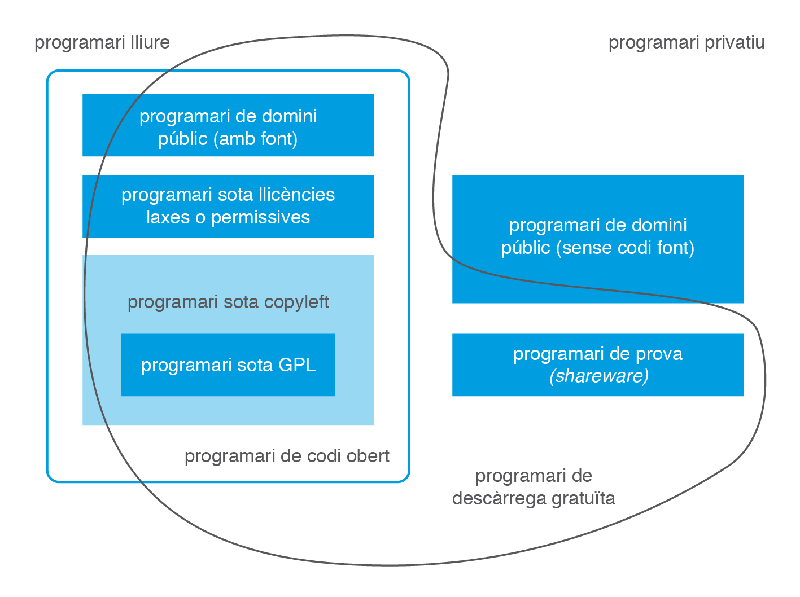
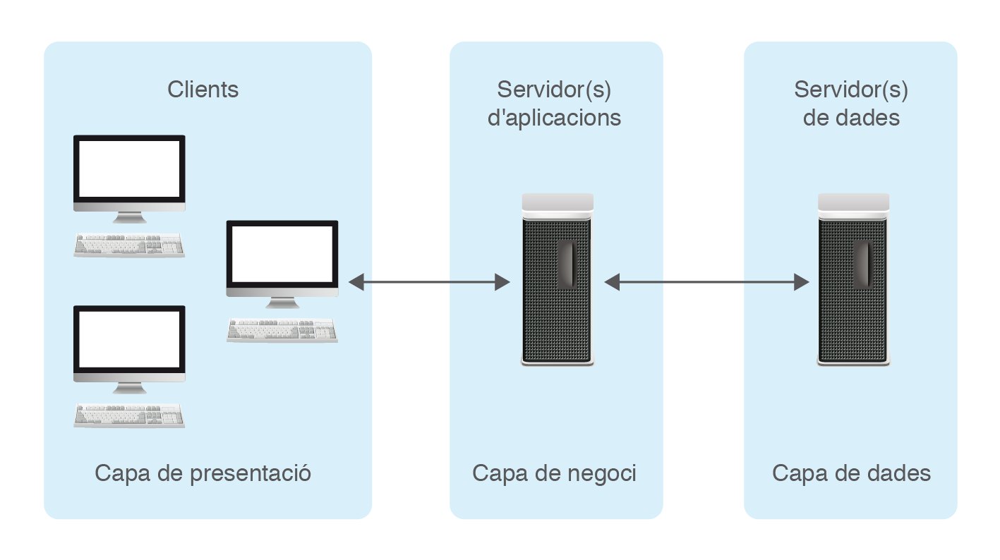

# 1.  Identificació de sistemes ERP-CRM i solucions BI

Les empreses necessiten, per a una òptima gestió empresarial, un suport  informàtic adequat a les necessitats de l’empresa. Per aquest motiu hi  ha en el mercat diversos programes informàtics: gestió comercial,  compravenda, facturació, comptabilitat, nòmines, producció, relació amb  els clients… molts d’ells englobats en paquets que es distribuïxen com a unitats o de forma modular.

Els **sistemes ERP**, de l’anglès *Enterprise Resource Planning*, coneguts àmpliament com a sistemes de planificació de recursos  empresarials, són sistemes que integren o pretenen integrar totes les  dades i processos d’una organització en un sistema unificat. Aquesta  definició pot portar a confondre els ERP amb els paquets comercials que  engloben diversos programes. És important conèixer la frontera entre  els diferents tipus de productes.

Els **sistemes CRM**, de l’anglès *Customer Relationship Management*, coneguts com a sistemes de gestió de la relació amb els clients, són  sistemes que donen suport a la gestió de les relacions amb els clients, a la venda i al màrqueting.

Les **solucions BI**, de l’anglès *Business Intelligence*, conegudes com a solucions d’intel·ligència de negoci o solucions  d’intel·ligència empresarial, són un conjunt d’eines destinades a  facilitar dades als dirigents empresarials, obtingudes a partir de les  dades dels sistemes ERP-CRM, amb l’objectiu d’ajudar a la presa de  decisions. El ventall de solucions BI és ampli: des d’eines d’elaboració d’informes fins a sofisticades eines de gestió de cubs OLAP.

Abans de fer la instal·lació, configuració, explotació i adequació de sistemes ERP-CRM i solucions BI, ens convé conèixer:

1.  Els tipus de llicenciament actuals.
2.  Els tipus de desplegament (implantacions) actuals i requisits associats.
3.  Les funcionalitats normalment proporcionades per les aplicacions ERP/CRM/BI.
4.  Els principals productes existents en el mercat.

## 1.1 Llicències de programari

En el mercat actual trobem un gran nombre d’aplicacions que poden tenir  utilitat a les empreses. Totes elles van acompanyades d’un determinat  tipus de llicència. Per altra banda, ha proliferat un gran nombre de  tipus de llicències de programari. En conseqüència, ens cal poder  reconèixer la llicència que acompanya cada programari i les seues  implicacions.

`Una llicència de programari és l’autorització o permís concedit pels autors del programari per poder-lo utilitzar, baix uns drets i deures.`

El nostre objectiu no és conèixer l’evolució que han tingut els conceptes programari lliure i programari privatiu, sinó conèixer els conceptes existents i utilitzats en el moment actual.

Pel que fa al programari lliure, ens cal saber que, segons la Free Software Foundation, un programari és lliure quan garanteix les **quatre llibertats** següents (enumerades a partir del valor zero); davant d’aquesta definició, qualsevol programari que violi alguna de les quatre llibertats passa a ser programari privatiu. Així, un programari és lliure quan es té: 

1. Llibertat d’utilitzar el programa per a qualsevol propòsit.
2. Llibertat d’estudiar el funcionament del programa, modificant-lo i adaptant-lo a nous requisits.
3. Llibertat de distribuir còpies del programa.
4.  Llibertat de millorar el programa i fer públiques les millores, de manera que tota la comunitat se’n beneficie.

Sovint, el concepte programari lliure es confon amb programari gratuït i/o amb codi obert i els tres conceptes són diferents, malgrat tenir punts en comú:

- La confusió entre programari lliure i programari gratuït és causada per l’ambigüitat del terme **free** en la llengua anglesa, on té doble significat: llibertat i gratuïtat. Certament, la majoria de programari lliure acostuma a ser gratuït, però això no és obligatori. Hi pot haver programari lliure no gratuït i programari gratuït no lliure. El concepte anglès a utilitzar per fer referència al programari gratuït (siga o no lliure) és freeware.
- La confusió entre programari lliure i codi obert (open source) és simple d’explicar, ja que el programari lliure, per tal de garantir les llibertats 1 i 3, obliga a tindre accés al codi del programari, és a dir, el programari lliure té el codi obert. Però darrere dels termes programari lliure i codi obert hi ha dos moviments ben diferenciats des del punt de vista filosòfic.

La utilització del concepte de codi obert va aparèixer per primera vegada l’any 1998, quan alguns usuaris del moviment pel programari lliure el van utilitzar per substituir el nom programari lliure a causa de l’ambigüitat del terme free en la llengua anglesa. Però per alguns seguidors del moviment pel programari lliure la substitució no es va considerar adequada, ja que es perdia el sentit ètic i moral implícit en el mot llibertat utilitzat en la definició del programari lliure. Així es va produir una escissió del moviment pel programari lliure, apareixent la Open Source Initiative.

La iniciativa pel codi obert exigeix que la distribució del **programari de codi obert** ha de verificar el següent decàleg:

1. Lliure redistribució: el programari ha de poder ser regalat o venut lliurement.
2. Codi font: el codi font ha d’estar inclòs o s’ha de poder obtenir lliurement.
3. Treballs derivats: la redistribució de modificacions ha d’estar permesa.
4. Integritat del codi font de l’autor: les llicències poden requerir que les modificacions siguin redistribuïdes només com a pegats.
5. Sense discriminació de persones o grups: no es pot deixar ningú a fora.
6. Sense discriminació d’àrees d’iniciativa: no es pot restringir a ningú que faci ús del programa en un camp específic d’activitat. Per exemple, no es pot impedir que el programa sigui utilitzat en un negoci o que s’utilitzi per a la investigació genètica.
7. Distribució de la llicència: s’ha d’aplicar els mateixos drets a tothom que rebi el programa.
8. La llicència no ha de ser específica d’un producte: el programa no es pot llicenciar només com a part d’una distribució major.
9. La llicència no ha de restringir cap altre programari: la llicència no pot obligar que algun altre programari que sigui distribuït amb el programari obert hagi de ser també de codi obert.
10. La llicència ha de ser tecnològicament neutral: l’acceptació de la llicència no es pot basar en una tecnologia o un estil d’interfície. Per exemple, no es pot requerir l’acceptació de la llicència a través d’un clic de ratolí o de cap forma específica del mitjà de suport del programari.

El decàleg del codi obert és compatible amb les quatre llibertats del programari lliure i, des d’un punt de vista pràctic, ambdós moviments són equivalents, però són totalment incompatibles des d’un punt de vista filosòfic.

Pels defensors del codi obert, el fet de tenir accés total al codi font del programari és una qüestió pràctica que possibilita que el programari evolucioni, es desenvolupi i millori a una alta velocitat, més alta que la que es pot assolir en els processos convencionals de desenvolupament de programari. Pels defensors del codi obert les llibertats esgrimides pel programari lliure no tenen importància; l’objectiu és, únicament, tenir accés al codi per tal d’assolir un codi millor. En conseqüència, pel moviment del codi obert, el codi tancat mai podrà ser millor que el codi obert.

Pels defensors del programari lliure allò que importa és la defensa de les llibertats; l’accés al codi és conseqüència de les llibertats 1 i 3 i la qualitat del codi tancat no té per què ser inferior a la del codi obert.

La distinció dels conceptes programari lliure, programari privatiu i codi obert és el primer pas per categoritzar un programari, però ens manca conèixer més conceptes utilitzats actualment. La figura 1.1, original de Chao-Kuei i posteriorment actualitzada per altres, situa les diferents categories del programari, que ens cal identificar: 

1. Programari **de domini públic**: programari que no està protegit amb copyright. El copyright reflectix  la possessió del dret d’explotació i, per tant, només el pot fer constar el titular o cessionari d’aquest dret.

2. Programari **baix \*copyleft\*** (còpia permesa): les llicències *copyleft* són aquelles que exercixen els autors del programari, emparats en la  legislació de copyright, per permetre la lliure distribució de còpies i  versions modificades d’una determinada obra. La majoria de les  llicències *copyleft* exigixen que els drets concedits es mantinguen en les versions modificades del producte.

3. Programari **baix GPL**: la llicència GPL (Llicència Pública General de GNU) és una llicència creada per la *Free Software Foundation*, orientada a protegir la lliure distribució, modificació i utilització  del programari, de manera que el programari cobert per aquesta llicència és programari lliure i queda protegit de qualsevol intent d’apropiació  que restringisca les llibertats del programari lliure. La formulació de GPL és tan restrictiva que impedeix que el programari baix d'aquesta llicència pugui ser integrat en programari privatiu.

4. Programari **baix llicències laxes o permissives**: les llicències laxes o permissives són llicències de programari lliure  flexibles respecte a la distribució, de manera que el programari puga  ser redistribuït com a programari lliure o privatiu. Són llicències  sense *copyleft*, ja que consideren que el treball derivat no té  per què mantenir el mateix règim de drets d’autor que l’original. Això  dóna total llibertat a qui rep el programari per desenvolupar-ne  qualsevol producte derivat, i li permet escollir entre l’ampli ventall  de llicències existents. Des del punt de vista dels usuaris, però,  aquestes llicències es poden considerar com una restricció a les  llibertats que defensa el programari lliure. Exemples de llicències  d’aquest tipus són les llicències BSD i MIT.

5. Programari **de prova** (*shareware*): les llicències *shareware* autoritzen la utilització d’un programa per tal que l’usuari l’avalue i posteriorment l’adquirisa. Aquest programari acostuma a tenir unes  limitacions, ja siga en el temps d’utilització o en les funcionalitats  permeses.

## 1.2 Tipus de desplegament i requisits associats

Tradicionalment, les aplicacions ERP/CRM/BI han estat allotjades a les instal·lacions de les organitzacions compradores de les llicències de l’aplicació; desplegament conegut majoritàriament com a on-premise i, en menor grau, com a in-house. Però això està canviant.

La història dels tipus de desplegament de les aplicacions de gestió empresarial ha anat lligada a l’evolució que ha tingut la tecnologia. En aquests moments podem dir que estem entrant en una nova època: l’època de la informàtica en núvol (cloud computing) i amb ella, diversos models de desplegament (IaaS, PaaS i SaaS) que s’imposaran o conviuran amb el model tradicional on-premise.

Per saber on som, ens convé, en un primer lloc, conèixer els tipus de desplegament que hi ha hagut al llarg de la història i, per poder dur a terme desplegaments en el moment actual, ens cal poder distingir els requisits associats.

### 1.2.1 Des dels 'mainframes' fins al 'cloud computing'

En la **primera època** (la dècada dels 60 i dels 70) les aplicacions residien en grans ordinadors (mainframes) ubicats en les dependències de l’organització i els usuaris disposaven de terminals (pantalles sense memòria ni capacitat de procés) connectades amb l’ordinador central.

La **segona època** arriba en la dècada dels 80, amb l’eclosió dels ordinadors personals. Les aplicacions empresarials van anar adoptant l’arquitectura de dues capes (client-servidor), en les quals continua existint l’ordinador central (servidor –un o diversos–) que conté les bases de dades i en la qual la terminal de l’anterior època queda substituïda per l’ordinador personal que, en disposar de memòria i capacitat de procés, incorpora les aplicacions a executar. L’arquitectura client-servidor agreuja prompte el problema del manteniment de les aplicacions, ja que cada vegada que la lògica de negoci canvia o evoluciona cal actualitzar l’aplicació en tots els ordinadors personals clients.

Per aquest motiu, s’adopta ben prompte** l’arquitectura de tres capes** (presentació-negoci-dades) il·lustrada a la figura 1.2, en la qual els clients tenen aplicacions senzilles que únicament presenten les dades subministrades per un o diversos servidors d’aplicacions, contenidors de la capa de negoci, que confeccionen aquelles dades a partir de la informació subministrada pels servidors de la capa de dades.

La **tercera època** s’inicia a mitjans de la dècada dels 90, coincidint amb el *boom* d’Internet i va acompanyada de la contínua millora de l’amplada de  banda. Les aplicacions empresarials busquen mecanismes per facilitar la  connexió dels òrgans de comandament de les empreses des d’ubicacions  remotes. Això fa que proliferen programaris que, aprofitant Internet,  faciliten la connectivitat remota i obrin en els dispositius remots  (portàtils i PDA) sessions client contra el servidor d’aplicacions. De  ben segur que un dels programaris més coneguts és l’escriptori remot del sistema operatiu Microsoft Windows. Però aquests programaris presenten  un problema: cal tenir instal·lat en el dispositiu remot el programari  adequat per poder establir la connexió i això no sempre és factible. Ara bé, sense por a equivocar-nos, quin és el programari que tenen avui en  dia tots els dispositius que es connecten a Internet, siga quin siga  el sistema operatiu utilitzat (Windows, Linux, Mac, iOS, Android…)? Un  navegador, veritat? En conseqüència, es tracta d’aconseguir que a través del  navegador puguem executar les aplicacions empresarials.

Durant la primera dècada del **segle XXI**, encara dins la  tercera època, les aplicacions empresarials es van acomodant a la nova  situació tecnològica i faciliten solucions accessibles des dels  navegadors web. L’arquitectura de tres capes continua sent vàlida per a  la nova situació. Simplement cal afegir un servidor web davant el(s)  servidor(s) d’aplicacions per permetre la connexió des dels navegadors.  Els clients tradicionals poden continuar existint i es comuniquen  directament amb el(s) servidor(s) d’aplicacions. La [figura.3](https://ioc.xtec.cat/materials/FP/Recursos/fp_dam_m10_/web/fp_dam_m10_htmlindex/WebContent/u1/a1/continguts.html#XXAFigura3) n’il·lustra la situació. 

En aquesta nova arquitectura hi ha desavinences sobre la capa on ubicar  el servidor web. Hi ha autors que, a causa del fet que el servidor web  simplement s’encarrega de confeccionar les pàgines que es visualitzen en el navegador, el consideren com a part de la capa de presentació.  D’altres, com que és un servidor d’aplicacions, l’ajunten amb els  servidors d’aplicacions on hi ha la capa de negoci. Per últim, hi ha  autors que parlen d’arquitectura de quatre capes, destinant una capa  específicament al servidor web. 

L’arquitectura de quatre capes (aplicacions empresarials que permeten  l’accés web) és d’extrema actualitat. Les aplicacions que no incorporen  aquesta funcionalitat estan abocades a la desaparició. Poden sobreviure a causa del cost que suposa un canvi total de programari, però  difícilment podran ampliar la seva quota de mercat.