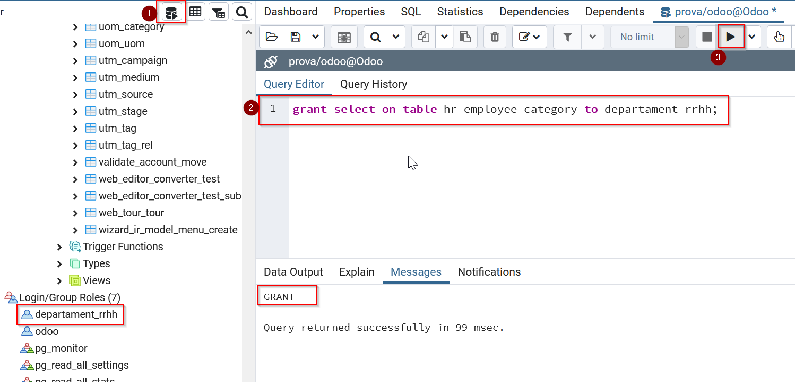

[TOC]

## 1. INTRODUCCIÓ
En aquesta unitat mostrarem com implantar un sistema Odoo 17 en una empresa. Per a això ens valdrem d'un exemple d'implantació d'un sistema ERP dins d'un determinat escenari. Partirem del context en què tenim un sistema Odoo amb la instal·lació bàsica proposada en la unitat anterior.

  L’explotació i adequació de l’ERP d’una organització és una tasca imprescindible, ja que garantix que el programari es mantinga en condicions de ser utilitzat per l’organització per tal de donar eixida a les seues necessitats. Per poder-ho dur a terme, per una banda cal identificar les necessitats (tasca pròpia de consultors) i, per una altra, tenir un coneixement profund de l’ERP, tant en les funcionalitats que facilita (tasca de consultors i implantadors) com en les qüestions tècniques vinculades a l’ERP (tasca d’analistes i programadors). 

La nostra tasca com a **programadors** consistirà a conèixer l’arquitectura de l’ERP i les eines de  desenvolupament que s’han d’utilitzar per poder fer el vestit a mida que necessita l’organització. El gran ventall d’arquitectures i d’eines  vinculades als ERP fa impossible efectuar un aprenentatge estàndard  d’explotació i adequació d’ERP i, per tant, ens centrarem a clarificar  els punts clau que s’han de tenir en compte i els posarem en pràctica  sobre la **versió 17 d’Odoo**.

Odoo és un programari de gestió empresarial desenvolupat sobre el *framework* OpenObject de tipus **RAD** (*Rapid Application Development*). La facilitat dels entorns RAD es basa en el fet que el desenvolupament  d’aplicacions és molt simple per al programador, de manera que amb poc  esforç es poden obtenir aplicacions d’altes prestacions.

L’OpenObject facilita diversos components que permeten construir l’aplicació:

-  La **capa ORM** (*Object Relational Mapping*), entre els objectes Python i la base de dades PostgreSQL. El  dissenyador-programador no efectua el disseny de la base de dades;  únicament dissenya classes, per a les quals la capa ORM d’OpenObject  n’efectuarà el mapatge sobre l’SGBD PostgreSQL.
-  Una **arquitectura MVC** (model-vista-controlador) en la qual el model resideix en les dades de  les classes dissenyades amb Python, la vista resideix en els formularis, llistes, calendaris, gràfics… definits en fitxers XML i el controlador  resideix en els mètodes, definits en les classes, que proporcionen la  lògica de negoci.
-  Un **sistema de fluxos de treball** o *workflows*.
-  **Dissenyadors d’informes**.
-  Facilitats de **traducció** de l’aplicació a diversos idiomes.

El nostre objectiu és conèixer com es dissenya i s’implementa el model  de dades en OpenObject. Abans, però, caldrà aprofundir en el coneixement de la **base de dades** d’una empresa d’Odoo, amb dues finalitats:

-  Conèixer la relació existent entre  els seus elements (taules i columnes) i els elements que observem en  qualsevol dels formularis i informes d’Odoo.
-  Saber com accedir a les dades de l’empresa atacant directament la base de dades.

Una vegada coneguda l’estructura d’una base de dades d’Odoo, ens podem endinsar en el **disseny del model** en Odoo, i ho fem en dues fases:

1.  Utilitzem l’eina de diagramació Dia, que possibilita la generació d’un diagrama UML i a partir de l’eina ens iniciem en el disseny del model de dades d’Odoo.
2.  Ens endinsem en el disseny del model de dades d’Odoo utilitzant el llenguatge Python.

La gran diversitat de funcionaments de les empreses fa que siga  altament improbable que un ERP estiga ideat per donar eixida a totes  les **necessitats empresarials**. Quan es detecta una  funcionalitat no coberta per l’ERP, hi ha tres camins per trobar-hi una  solució. Per una banda, es pot adequar l’ERP per donar resposta a les  funcionalitats requerides. Per l’altra, es pot adequar el funcionament  de l’empresa a les funcionalitats facilitades per l’ERP. O bé un tercer  camí, basat en la combinació dels dos camins anteriors.

El fet que l’empresa canvie el seu funcionament per **adaptar-se a l’ERP**, tot i semblar molt brusc, és una solució que s’adopta en moltes  ocasions, sobretot quan els consultors són capaços de demostrar als  responsables de l’organització que el nou funcionament té clars  avantatges respecte als mètodes emprats en aquell moment per l’empresa. 

Cal tenir en compte que, a vegades, l’empresa pot haver establert els  seus funcionaments –en temps passats– coaccionada per les possibilitats  del sistema informàtic vigent en aquell moment, i aquests funcionaments  han esdevingut, amb el pas del temps, maneres de fer fonamentals i  intocables en l’organització. En aquestes ocasions, la mà esquerra dels  consultors i implantadors és fonamental per dur a terme la implantació  de l’ERP amb èxit.

Tot i això, no sempre es poden adequar els mètodes de l’empresa a les  funcionalitats facilitades per l’ERP i, en conseqüència, cal adequar  l’ERP, fet que pot comportar la necessitat de desenvolupar mòduls  específics que es puguen acoblar a l’ERP i/o retocar mòduls (formularis i informes) de l’ERP.

L’adequació d’un ERP a través del **desenvolupament de mòduls específics** es pot dur a terme, en principi, amb qualsevol llenguatge de  programació i accedint directament a la base de dades de l’ERP. Fer-ho  així, però, comporta **inconvenients**:

-  Accedir directament a la base de  dades implica tenir un coneixement total de la base de dades i de les  relacions existents entre els seus components. Aquestes relacions poden  canviar en una actualització de l’ERP.
-  Els mòduls desenvolupats amb un  llenguatge de programació forà a l’ERP impliquen tenir peces fora de  l’ERP, excepte si som capaços d’emular la interfície de l’ERP i  d’introduir les noves opcions a l’arbre de menús de l’ERP.

El **retoc de mòduls** (formularis i informes) de l’ERP també té inconvenients:

-  Només és possible si disposem del codi font de l’ERP (opció vàlida en programaris de codi obert).
-  Els retocs efectuats han de  garantir-ne la continuïtat en properes actualitzacions de l’ERP sense  necessitat de tornar-los a desenvolupar.

Els diversos inconvenients presentats ens porten a la necessitat de  conèixer i utilitzar els mètodes de desenvolupament i/o retoc de mòduls  de l’ERP facilitats pel fabricant. A més, cal efectuar els processos d’**actualització de dades** (altes, baixes i modificacions) a través de les regles de negoci de  l’ERP, que tenen en compte totes les implicacions, i mai amb accessos  directes a la base de dades.

Cal tenir en compte, també, que a vegades pot ser convenient accedir a  les dades en mode consulta per extreure’n informació. En aquests casos,  tenint coneixement de l’estructura de la base de dades, l’accés directe a la base de dades pot ser adequat, amb la precaució que l’estructura pot canviar en futures actualitzacions de l’ERP.

A vegades, dins de les organitzacions hi ha persones que, possiblement  per mancances de bones solucions BI vinculades a l’ERP, necessiten  accedir a la base de dades per extreure’n informació (mode consulta) i,  des de les eines ofimàtiques que dominen (bases de dades ofimàtiques i  fulls de càlcul), desenvolupar informes i quadres de comandament (*dashboards*) adequats a les seues necessitats. 

En aquest cas, l’accés directe (mode consulta) a la base de dades també  és lògic, tot i que l’usuari ha de ser conscient que els seus muntatges  es poden veure afectats davant d’una actualització de l’ERP.

Aquests raonaments ens porten a les **conclusions** següents:

-  Cal conèixer l’estructura de la base de dades de l’ERP i possibilitar-hi accessos en mode consulta, per  extreure’n informació que puga ser gestionada des d’eines externes.
-  Cal conèixer la gestió de regles de negoci de l’ERP.
-  Cal conèixer les eines recomanades  pel fabricant de l’ERP per al desenvolupament i/o retoc de mòduls de  l’ERP, fet que pot anar acompanyat del coneixement de llenguatges de  programació.

### 1.1 Context del cas pràctic: Restaurant l'Assaig
El restaurant de l'Assaig és l'aula de formació dels companys dels cicles d'Hostaleria i Restauració. 

Es planteja modernitzar el seu negoci. Després de plantejar diverses opcions, es baralla l'opció d'utilitzar Odoo 17 Community Edition, especialment per ser lliure i gratuït. 

### 1.2 La base de dades d'Odoo

La gestió d’una empresa pot fer necessari, en un determinat moment, l’accés a la base de dades de l’ERP per tal d’obtenir informació en un format no facilitat per l’ERP. Per això, és important conèixer el disseny de la BD (base de dades) de l’ERP i, en el nostre cas, de l’Odoo.

> A Odoo no hi ha un disseny explícit de la base de dades, sinó que la **base de dades d’una empresa d’Odoo** és el resultat del mapatge del disseny de classes de l’ERP cap a l’SGBD PostgreSQL, que és el que proporciona la persistència necessària per  als objectes.

En conseqüència, l’Odoo no facilita cap disseny entitat-relació sobre la  base de dades d’una empresa ni tampoc cap diagrama del model relacional. No obstant això, si ens interessa disposar d’un model relacional, es  troben moltes eines que ens el poden construir a partir de la base de  dades implementada en l’SGBD PostgreSQL.

#### 1.2.1 Pas previ: connexió a la base de dades mitjançant Pgadmin 4

Tant si estem treballant amb la instal·lació d’Odoo en Windows, com si ens estem connectant a un servidor extern, és important poder establir una connexió amb la base de dades per facilitar la seva comprensió. 

A continuació podem veure un [vídeo](https://player.vimeo.com/video/472569113) on s’explica aquesta connexió per als dos casos descrits anteriorment amb el client pgadmin.

#### 1.2.2 Identificar les taules d'Odoo

Si sorgix la necessitat de detectar la taula o les taules on resideix una informació determinada, és perquè es coneix l’existència d’aquesta  informació gestionada des de l’ERP i, per tant, es coneix algun  formulari de l’ERP a través del qual s’introdueix la informació.

L’Odoo possibilita, mitjançant el client web, recuperar el nom de la  classe Python que defineix la informació que s’introdueix a través d’un  formulari i el nom de la dada membre de la classe corresponent a cada  camp del formulari. Aquesta informació permet arribar a la taula i  columna afectades, tenint en compte dues qüestions:

-  Els **noms de les classes Python d’Odoo** sempre van en minúscula (s’utilitza el guió baix per fer llegibles els  termes compostos) i segueixen la nomenclatura  nom_del_modul.nom1.nom2.nom3…, en la qual s’utilitza el punt per indicar un cert nivell de jerarquia. Cada classe Python d’Odoo és mapada en una taula de PostgreSQL amb moltes possibilitats que el seu nom coincidisca amb el nom de la classe, tot substituint els punts per guions baixos.
-  Els **noms dels atributs d’una classe Python** sempre van en minúscula (s’utilitza el guió baix per fer llegibles els  termes compostos). Cada dada membre d’una classe Python d’Odoo que siga  persistent (una classe pot tenir dades membres calculades no  persistents) és mapat com un atribut en la corresponent taula de  PostgreSQL amb el mateix nom.

**Exemple**: Classe de hr.employee.category

La classe Python `hr.employee.category` està pensada per emmagatzemar les diferents categories d’empleats que  hi ha al departament de recursos humans. Si revisem el seu codi font,  veiem que el nom seguix les regles esmentades anteriorment ([figura 1.1](../assets/imatges/03_1_classe_python.png)).

Ara anirem a la base de dades (fent servir pgadmin), esperant trobar una  taula PostgreSQL amb el mateix nom, substituint els punts per guions  baixos ([figura 1.2](assets/imatges/03_2_taula_postgres.png))

D’aquesta manera, coneixent el nom de la classe i el nom de la dada membre, és  molt possible conèixer el nom de la taula i de la columna corresponents. Es pot configurar el client web per tal que informe del nom de la  classe i de la dada membre, en situar el ratolí damunt les etiquetes  dels camps dels formularis. Aquesta opció es diu **mode programador**. Tal com es pot veure a la [figura 1.3](assets/imatges/03_3_mode_programador.png), es troba al menú de configuració.

Una vegada activat aquest mode, només apropant el ratolí al camp del formulari que ens interessa, veurem un tooltip amb informació. 

Per al camp **`adreça electrònica`** obtenim que es tracta del camp `work_email` de l’objecte `hr.employee` i, per tant, si necessitem efectuar una consulta sobre la base de dades accedint a la data de la comanda, sabem que haurem d’anar al camp `work_email` de la taula `hr_employee` de la base de dades de PostgreSQL ([figura.1.4](assets/imatges/03_4_camp_email.png) i [figura 1.5](assets/imatges/03_5_work_email_BBDD.png)).

Per al camp **`categoria`** tenim molta més informació, ja que es tracta del camp relacional `category_ids` de l’objecte `hr.employee`, que fa referència a la relació `hr.employee.category`. Amb aquesta informació, si necessitem efectuar una consulta a la base  de dades per accedir a la descripció de la botiga corresponent a la  comanda sabem que haurem d’anar al camp `category_ids` de la taula `hr_employee` i a través d’aquest camp, establirem una relació (haurem de veure quina) amb la clau primària de la taula `hr_employee_category` ([figura 1.6](assets/imatges/03_6_tooltip.png)). Destaca la relació `Many2many`, que veurem més endavant.

Si volem veure les relacions que s’estableixen entre les taules `hr_employee` i `hr_employee_category`, obrim una eina que permeta construir aquestes relacions, en aquest cas, **dbeaver**. Aquest és el resultat ([figura 1.7](assets/imatges/03_7_relacions.png "Relacions entre taules").

Podem veure que hi ha una taula intermediària, amb el nom `employee_category_rel`, que fa de pont entre totes dues taules. 

#### 1.2.3 Accés de només lectura a la base de dades

Les empreses acostumen a tenir, entre els seus responsables, usuaris finals que poden efectuar **consultes no previstes** a la base de dades i que, per aconseguir-ho, poden utilitzar eines  gràfiques per elaborar consultes o, fins i tot, si són prou espavilats,  executar consultes SQL des d’una consola d’accés.

En aquesta situació, cal facilitar als usuaris que calga un usuari per  accedir a l’SGBD PostgreSQL amb els privilegis d’accés, en mode  consulta, als objectes de la base de dades que correspongui. S’aconsella seguir dos **passos**:

1.  Crear els usuaris d’SGBD amb les contrasenyes que corresponguen.
2.  Donar els privilegis d’accés adequats als usuaris que corresponguen (només de lectura).

##### Crear els usuaris d'SGBD

Per tal de crear els usuaris d’SGBD utilitzem l’eina d’administració de  PostgreSQL pgAdmin. Hem de connectar-nos a l’SGBD PostgreSQL amb un  usuari amb privilegi de creació d’usuaris (rol CREATEROLE) de l’SGBD.  Amb aquestes dues coses, podem crear els usuaris d’SGBD amb les  contrasenyes que corresponguin ([figura 1.8](assets/imatges/03_8_crea_role.png)).

Una vegada connectats amb aquest usuari, procedim a crear l’usuari o els usuaris que tindran **drets de consulta**. En aquest cas farem un usuari per al cap de recursos humans, i un altre per al cap d’administració. La [figura 1.9](assets/imatges/03_9_nou_role.png) mostra la pantalla que facilita pgAdmin per crear un nou usuari (botó secundari del ratolí damunt del node *Login Roles* de l’*Object Browser* i seleccionar l’opció *New Login Role*).

##### Donar privilegis d'accés

Suposem que volem crear un usuari de la base de dades cap del departament de Recursos Humans. Ens interessa que aquest usuari puga connectar-se a la base de dades mitjançant una interfície web, com ara una aplicació BI, però és vital que no puga fer canvis a la base de dades. Primer generarem aquest usuari, i a continuació triarem les taules que necessita consultar, i li donarem permisos de només lectura.

Crearem, per tant, un login role per a aquest usuari. Ens col·loquem als rols i fem clic en el botó dret [(figura 1.10)](assets/imatges/03_10_creacio_nou_role.png "Creació del nou usuari"). 

L’assignació de privilegis s’efectua sobre cada objecte i, a través de pgAdmin, per  donar privilegis a un objecte determinat cal situar-se damunt del nom de l’objecte, dins l’*Object Browser*, editar-ne les propietats (amb el botó secundari del ratolí) i anar a la pestanya *Privileges*.

Els **privilegis** es poden concedir ([figura 1.11](assets/imatges/03_11_privilegis_columna.png)):

-  Pel que fa a la base de dades (per permetre o no l’accés), 
-  Pel que fa a l’esquema (per utilitzar-lo i/o crear-hi objectes), 
-  Pel que fa als objectes de la base de dades (taules, vistes, funcions, disparadors…)
-  Fins i tot, pel que fa a les  columnes de les taules i vistes, per donar privilegis d’accés a  columnes, cal situar-se damunt la columna i editar les seves propietats.

Per tant, donarem privilegis de només lectura a la taula `hr_employee` a l’usuari creat per a les consultes del departament de Recursos  Humans. Seleccionarem la taula, anirem a les seves propietats, i a la  pestanya *Seguretat* indicarem que té privilegis de lectura ([figura 1.12](assets/imatges/03_12_permis_lectura.png)).

També es pot fer mitjançant llenguatge SQL ([figura 1.13](assets/imatges/03_13_sql_permis_lectura.png)):

##### Comprovació de privilegis

Una manera ràpida de veure, des de pgAdmin, els privilegis concedits a un  objecte, és situar-nos damunt de l’objecte i veure, a la part dreta de  la pantalla, el contingut de la **propietat ACL** (*Access Control List*); tal com es mostra a la [figura 1.14](assets/imatges/03_14_verificacio_privilegis.png).

De la mateixa manera que hem vist la llista ACL sobre la taula `hr_employee`, podem situar-nos damunt de qualsevol objecte de la base de dades  (esquema, taula, vista, columna…) i tindrem accés a la llista ACL dels privilegis concedits sobre aquell objecte.

Imaginem el cas en què una taula no té definida la llista ACL; això suposarà un **forat de seguretat**, ja que en principi permet l’accés a qualsevol usuari. Per tal que no hi hagi cap privilegi d’accés, la llista ACL hauria de mostrar el valor {}. Podem aconseguir-ho afegint qualsevol  usuari a l’esquema de seguretat, guardant i tornant a editar per  esborrar l’usuari. Quan enregistrem el canvi, veurem que el valor d’ACL és {}. La situació ideal és tenir definits els privilegis de només un grup reduït d’usuaris. A la [figura 1.15](assets/imatges/03_15_esquemes_segureat.png) podem revisar tots tres casos.

Un punt molt important a tenir en compte en la gestió de privilegis de PostgreSQL és **conèixer els privilegis existents**, de forma automàtica, després de la creació d’una base de dades (vegeu la [figura 1.16](assets/imatges/03_16_acl_esquema_public.png)). Cal saber que:

-  La base de dades es crea amb ACL no definida, fet que permet que qualsevol usuari del servidor PostgreSQL pugui obrir sessió en aquella base de dades.
-  PostgreSQL facilita el rol `public`, que engloba tots els usuaris de forma automàtica.
-  PostgreSQL facilita, a totes les bases de dades, l’esquema `public`, propietat de l’usuari que ha creat la base de dades, i amb privilegis d’utilització de l’esquema (`usage`) i creació d’objectes (`create`) al rol `public` (és a dir, a qualsevol usuari). Així, si observem la propietat ACL de l’esquema `public` d’una base de dades creada per l’usuari `odoo`, veiem el valor `{odoo=UC/odoo, ``=UC``/``odoo}` que hem de llegir com: l’usuari `odoo` té privilegis `UC` (`usage+create`) i el rol `public` (no apareix a l’esquerra del símbol =) té privilegis `UC` (`usage+create`) i que en ambdós casos han estat concedits per l’usuari `odoo` (valor que apareix després del símbol `/`).

Un usuari qualsevol, pel fet de pertànyer al rol `public`, té accés `UC` sobre l’esquema `public` de qualsevol base de dades. Això implica que pot veure la relació  (noms) de tots els objectes existents a l’esquema (taules, vistes…),  veure la descripció de qualsevol objecte (taules, vistes…) i crear nous  objectes dins l’esquema, però no pot accedir als continguts de les  taules ni vistes, excepte si el propietari d’aquests objectes li  concedix accés. 

En cas que hàgem de facilitar accés a la base de dades corresponent a una empresa de PostgreSQL a **nous usuaris** i no ens interesse mantindre aquesta situació, hem de fer el següent:

-  Definirem el valor de la propietat ACL de la base de dades i indicarem els usuaris als quals es facilita el privilegi de connexió.
-  Modificarem el valor de la propietat ACL de l’esquema `public`, eliminarem l’assignació de privilegis al rol `public` i assignarem la utilització (només `usage`) de l’esquema `public` als usuaris o rols corresponents. Aquesta acció executada mentre el  servidor està engegat pot provocar que Odoo no puga connectar amb la  base de dades fins que es reinicie el servidor.
-  Assignarem els privilegis  (normalment de lectura) als usuaris o rols corresponents sobre els  objectes (taules, vistes, columnes…) que interesse. 