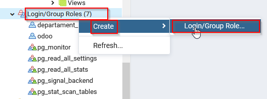
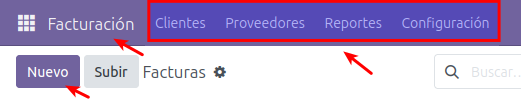

[TOC]

## 1. INTRODUCCIÓ
En aquesta unitat mostrarem com implantar un sistema Odoo 17 en una empresa. Per a això ens valdrem d'un exemple d'implantació d'un sistema ERP dins d'un determinat escenari. Partirem del context en què tenim un sistema Odoo amb la instal·lació bàsica proposada en la unitat anterior.

  L’explotació i adequació de l’ERP d’una organització és una tasca imprescindible, ja que garantix que el programari es mantinga en condicions de ser utilitzat per l’organització per tal de donar eixida a les seues necessitats. Per poder-ho dur a terme, per una banda cal identificar les necessitats (tasca pròpia de consultors) i, per una altra, tenir un coneixement profund de l’ERP, tant en les funcionalitats que facilita (tasca de consultors i implantadors) com en les qüestions tècniques vinculades a l’ERP (tasca d’analistes i programadors). 

La nostra tasca com a **programadors** consistirà a conèixer l’arquitectura de l’ERP i les eines de  desenvolupament que s’han d’utilitzar per poder fer el vestit a mida que necessita l’organització. El gran ventall d’arquitectures i d’eines  vinculades als ERP fa impossible efectuar un aprenentatge estàndard  d’explotació i adequació d’ERP i, per tant, ens centrarem a clarificar  els punts clau que s’han de tenir en compte i els posarem en pràctica  sobre la **versió 17 d’Odoo**.

Odoo és un programari de gestió empresarial desenvolupat sobre el *framework* OpenObject de tipus **RAD** (*Rapid Application Development*). La facilitat dels entorns RAD es basa en el fet que el desenvolupament  d’aplicacions és molt simple per al programador, de manera que amb poc  esforç es poden obtenir aplicacions d’altes prestacions.

L’OpenObject facilita diversos components que permeten construir l’aplicació:

-  La **capa ORM** (*Object Relational Mapping*), entre els objectes Python i la base de dades PostgreSQL. El  dissenyador-programador no efectua el disseny de la base de dades;  únicament dissenya classes, per a les quals la capa ORM d’OpenObject  n’efectuarà el mapatge sobre l’SGBD PostgreSQL.
-  Una **arquitectura MVC** (model-vista-controlador) en la qual el model resideix en les dades de  les classes dissenyades amb Python, la vista resideix en els formularis, llistes, calendaris, gràfics… definits en fitxers XML i el controlador  resideix en els mètodes, definits en les classes, que proporcionen la  lògica de negoci.
-  Un **sistema de fluxos de treball** o *workflows*.
-  **Dissenyadors d’informes**.
-  Facilitats de **traducció** de l’aplicació a diversos idiomes.

El nostre objectiu és conèixer com es dissenya i s’implementa el model  de dades en OpenObject. Abans, però, caldrà aprofundir en el coneixement de la **base de dades** d’una empresa d’Odoo, amb dues finalitats:

-  Conèixer la relació existent entre  els seus elements (taules i columnes) i els elements que observem en  qualsevol dels formularis i informes d’Odoo.
-  Saber com accedir a les dades de l’empresa atacant directament la base de dades.

Una vegada coneguda l’estructura d’una base de dades d’Odoo, ens podem endinsar en el **disseny del model** en Odoo, i ho fem en dues fases:

1.  Utilitzem l’eina de diagramació Dia, que possibilita la generació d’un diagrama UML i a partir de l’eina ens iniciem en el disseny del model de dades d’Odoo.
2.  Ens endinsem en el disseny del model de dades d’Odoo utilitzant el llenguatge Python.

La gran diversitat de funcionaments de les empreses fa que siga  altament improbable que un ERP estiga ideat per donar eixida a totes  les **necessitats empresarials**. Quan es detecta una  funcionalitat no coberta per l’ERP, hi ha tres camins per trobar-hi una  solució. Per una banda, es pot adequar l’ERP per donar resposta a les  funcionalitats requerides. Per l’altra, es pot adequar el funcionament  de l’empresa a les funcionalitats facilitades per l’ERP. O bé un tercer  camí, basat en la combinació dels dos camins anteriors.

El fet que l’empresa canvie el seu funcionament per **adaptar-se a l’ERP**, tot i semblar molt brusc, és una solució que s’adopta en moltes  ocasions, sobretot quan els consultors són capaços de demostrar als  responsables de l’organització que el nou funcionament té clars  avantatges respecte als mètodes emprats en aquell moment per l’empresa. 

Cal tenir en compte que, a vegades, l’empresa pot haver establert els  seus funcionaments –en temps passats– coaccionada per les possibilitats  del sistema informàtic vigent en aquell moment, i aquests funcionaments  han esdevingut, amb el pas del temps, maneres de fer fonamentals i  intocables en l’organització. En aquestes ocasions, la mà esquerra dels  consultors i implantadors és fonamental per dur a terme la implantació  de l’ERP amb èxit.

Tot i això, no sempre es poden adequar els mètodes de l’empresa a les  funcionalitats facilitades per l’ERP i, en conseqüència, cal adequar  l’ERP, fet que pot comportar la necessitat de desenvolupar mòduls  específics que es puguen acoblar a l’ERP i/o retocar mòduls (formularis i informes) de l’ERP.

L’adequació d’un ERP a través del **desenvolupament de mòduls específics** es pot dur a terme, en principi, amb qualsevol llenguatge de  programació i accedint directament a la base de dades de l’ERP. Fer-ho  així, però, comporta **inconvenients**:

-  Accedir directament a la base de  dades implica tenir un coneixement total de la base de dades i de les  relacions existents entre els seus components. Aquestes relacions poden  canviar en una actualització de l’ERP.
-  Els mòduls desenvolupats amb un  llenguatge de programació forà a l’ERP impliquen tenir peces fora de  l’ERP, excepte si som capaços d’emular la interfície de l’ERP i  d’introduir les noves opcions a l’arbre de menús de l’ERP.

El **retoc de mòduls** (formularis i informes) de l’ERP també té inconvenients:

-  Només és possible si disposem del codi font de l’ERP (opció vàlida en programaris de codi obert).
-  Els retocs efectuats han de  garantir-ne la continuïtat en properes actualitzacions de l’ERP sense  necessitat de tornar-los a desenvolupar.

Els diversos inconvenients presentats ens porten a la necessitat de  conèixer i utilitzar els mètodes de desenvolupament i/o retoc de mòduls  de l’ERP facilitats pel fabricant. A més, cal efectuar els processos d’**actualització de dades** (altes, baixes i modificacions) a través de les regles de negoci de  l’ERP, que tenen en compte totes les implicacions, i mai amb accessos  directes a la base de dades.

Cal tenir en compte, també, que a vegades pot ser convenient accedir a  les dades en mode consulta per extreure’n informació. En aquests casos,  tenint coneixement de l’estructura de la base de dades, l’accés directe a la base de dades pot ser adequat, amb la precaució que l’estructura pot canviar en futures actualitzacions de l’ERP.

A vegades, dins de les organitzacions hi ha persones que, possiblement  per mancances de bones solucions BI vinculades a l’ERP, necessiten  accedir a la base de dades per extreure’n informació (mode consulta) i,  des de les eines ofimàtiques que dominen (bases de dades ofimàtiques i  fulls de càlcul), desenvolupar informes i quadres de comandament (*dashboards*) adequats a les seues necessitats. 

En aquest cas, l’accés directe (mode consulta) a la base de dades també  és lògic, tot i que l’usuari ha de ser conscient que els seus muntatges  es poden veure afectats davant d’una actualització de l’ERP.

Aquests raonaments ens porten a les **conclusions** següents:

-  Cal conèixer l’estructura de la base de dades de l’ERP i possibilitar-hi accessos en mode consulta, per  extreure’n informació que puga ser gestionada des d’eines externes.
-  Cal conèixer la gestió de regles de negoci de l’ERP.
-  Cal conèixer les eines recomanades  pel fabricant de l’ERP per al desenvolupament i/o retoc de mòduls de  l’ERP, fet que pot anar acompanyat del coneixement de llenguatges de  programació.

### 1.1 Context del cas pràctic: Restaurant l'Assaig
El restaurant de l'Assaig és l'aula de formació dels companys dels cicles d'Hostaleria i Restauració. 

Es planteja modernitzar el seu negoci. Després de plantejar diverses opcions, es baralla l'opció d'utilitzar Odoo 17 Community Edition, especialment per ser lliure i gratuït. 

Dins de les seues tasques més comunes trobem les següents:

- Gestió d'aprovisionament i ordres de compra
- Prevenció de trencaments d'estoc en els productes
- Terminal punt de venda en sala i en menjar per endur
- Enviament massiu d'ofertes i carta de menús

### 1.2 La base de dades d'Odoo

La gestió d’una empresa pot fer necessari, en un determinat moment, l’accés a la base de dades de l’ERP per tal d’obtenir informació en un format no facilitat per l’ERP. Per això, és important conèixer el disseny de la BD (base de dades) de l’ERP i, en el nostre cas, de l’Odoo.

> A Odoo no hi ha un disseny explícit de la base de dades, sinó que la **base de dades d’una empresa d’Odoo** és el resultat del mapatge del disseny de classes de l’ERP cap a l’SGBD PostgreSQL, que és el que proporciona la persistència necessària per  als objectes.

En conseqüència, l’Odoo no facilita cap disseny entitat-relació sobre la  base de dades d’una empresa ni tampoc cap diagrama del model relacional. No obstant això, si ens interessa disposar d’un model relacional, es  troben moltes eines que ens el poden construir a partir de la base de  dades implementada en l’SGBD PostgreSQL.

#### 1.2.1 Pas previ: connexió a la base de dades mitjançant Pgadmin 4

Tant si estem treballant amb la instal·lació d’Odoo en Windows, com si ens estem connectant a un servidor extern, és important poder establir una connexió amb la base de dades per facilitar la seva comprensió. 

A continuació podem veure un [vídeo](https://player.vimeo.com/video/472569113) on s’explica aquesta connexió per als dos casos descrits anteriorment amb el client pgadmin.

#### 1.2.2 Identificar les taules d'Odoo

Si sorgix la necessitat de detectar la taula o les taules on resideix una informació determinada, és perquè es coneix l’existència d’aquesta  informació gestionada des de l’ERP i, per tant, es coneix algun  formulari de l’ERP a través del qual s’introdueix la informació.

L’Odoo possibilita, mitjançant el client web, recuperar el nom de la  classe Python que defineix la informació que s’introdueix a través d’un  formulari i el nom de la dada membre de la classe corresponent a cada  camp del formulari. Aquesta informació permet arribar a la taula i  columna afectades, tenint en compte dues qüestions:

-  Els **noms de les classes Python d’Odoo** sempre van en minúscula (s’utilitza el guió baix per fer llegibles els  termes compostos) i segueixen la nomenclatura  nom_del_modul.nom1.nom2.nom3…, en la qual s’utilitza el punt per indicar un cert nivell de jerarquia. Cada classe Python d’Odoo és mapada en una taula de PostgreSQL amb moltes possibilitats que el seu nom coincidisca amb el nom de la classe, tot substituint els punts per guions baixos.
-  Els **noms dels atributs d’una classe Python** sempre van en minúscula (s’utilitza el guió baix per fer llegibles els  termes compostos). Cada dada membre d’una classe Python d’Odoo que siga  persistent (una classe pot tenir dades membres calculades no  persistents) és mapat com un atribut en la corresponent taula de  PostgreSQL amb el mateix nom.

**Exemple**: Classe de hr.employee.category

La classe Python `hr.employee.category` està pensada per emmagatzemar les diferents categories d’empleats que  hi ha al departament de recursos humans. Si revisem el seu codi font,  veiem que el nom seguix les regles esmentades anteriorment ([figura 1.1](../assets/imatges/03_1_classe_python.png)).

Ara anirem a la base de dades (fent servir pgadmin), esperant trobar una  taula PostgreSQL amb el mateix nom, substituint els punts per guions  baixos ([figura 1.2](assets/imatges/03_2_taula_postgres.png))

D’aquesta manera, coneixent el nom de la classe i el nom de la dada membre, és  molt possible conèixer el nom de la taula i de la columna corresponents. Es pot configurar el client web per tal que informe del nom de la  classe i de la dada membre, en situar el ratolí damunt les etiquetes  dels camps dels formularis. Aquesta opció es diu **mode programador**. Tal com es pot veure a la [figura 1.3](assets/imatges/03_3_mode_programador.png), es troba al menú de configuració.

Una vegada activat aquest mode, només apropant el ratolí al camp del formulari que ens interessa, veurem un tooltip amb informació. 

Per al camp **`adreça electrònica`** obtenim que es tracta del camp `work_email` de l’objecte `hr.employee` i, per tant, si necessitem efectuar una consulta sobre la base de dades accedint a la data de la comanda, sabem que haurem d’anar al camp `work_email` de la taula `hr_employee` de la base de dades de PostgreSQL ([figura.1.4](assets/imatges/03_4_camp_email.png) i [figura 1.5](assets/imatges/03_5_work_email_BBDD.png)).

Per al camp **`categoria`** tenim molta més informació, ja que es tracta del camp relacional `category_ids` de l’objecte `hr.employee`, que fa referència a la relació `hr.employee.category`. Amb aquesta informació, si necessitem efectuar una consulta a la base  de dades per accedir a la descripció de la botiga corresponent a la  comanda sabem que haurem d’anar al camp `category_ids` de la taula `hr_employee` i a través d’aquest camp, establirem una relació (haurem de veure quina) amb la clau primària de la taula `hr_employee_category` ([figura 1.6](assets/imatges/03_6_tooltip.png)). Destaca la relació `Many2many`, que veurem més endavant.

Si volem veure les relacions que s’estableixen entre les taules `hr_employee` i `hr_employee_category`, obrim una eina que permeta construir aquestes relacions, en aquest cas, **dbeaver**. Aquest és el resultat ([figura 1.7](assets/imatges/03_7_relacions.png "Relacions entre taules").

Podem veure que hi ha una taula intermediària, amb el nom `employee_category_rel`, que fa de pont entre totes dues taules. 

#### 1.2.3 Accés de només lectura a la base de dades

Les empreses acostumen a tenir, entre els seus responsables, usuaris finals que poden efectuar **consultes no previstes** a la base de dades i que, per aconseguir-ho, poden utilitzar eines  gràfiques per elaborar consultes o, fins i tot, si són prou espavilats,  executar consultes SQL des d’una consola d’accés.

En aquesta situació, cal facilitar als usuaris que calga un usuari per  accedir a l’SGBD PostgreSQL amb els privilegis d’accés, en mode  consulta, als objectes de la base de dades que correspongui. S’aconsella seguir dos **passos**:

1.  Crear els usuaris d’SGBD amb les contrasenyes que corresponguen.
2.  Donar els privilegis d’accés adequats als usuaris que corresponguen (només de lectura).

##### Crear els usuaris d'SGBD

Per tal de crear els usuaris d’SGBD utilitzem l’eina d’administració de  PostgreSQL pgAdmin. Hem de connectar-nos a l’SGBD PostgreSQL amb un  usuari amb privilegi de creació d’usuaris (rol CREATEROLE) de l’SGBD.  Amb aquestes dues coses, podem crear els usuaris d’SGBD amb les  contrasenyes que corresponguin ([figura 1.8](assets/imatges/03_8_crea_role.png)).

Una vegada connectats amb aquest usuari, procedim a crear l’usuari o els usuaris que tindran **drets de consulta**. En aquest cas farem un usuari per al cap de recursos humans, i un altre per al cap d’administració. La [figura 1.9](assets/imatges/03_9_nou_role.png) mostra la pantalla que facilita pgAdmin per crear un nou usuari (botó secundari del ratolí damunt del node *Login Roles* de l’*Object Browser* i seleccionar l’opció *New Login Role*).

##### Donar privilegis d'accés

Suposem que volem crear un usuari de la base de dades cap del departament de Recursos Humans. Ens interessa que aquest usuari puga connectar-se a la base de dades mitjançant una interfície web, com ara una aplicació BI, però és vital que no puga fer canvis a la base de dades. Primer generarem aquest usuari, i a continuació triarem les taules que necessita consultar, i li donarem permisos de només lectura.

Crearem, per tant, un login role per a aquest usuari. Ens col·loquem als rols i fem clic en el botó dret [(figura 1.10)](assets/imatges/03_10_creacio_nou_role.png "Creació del nou usuari"). 

L’assignació de privilegis s’efectua sobre cada objecte i, a través de pgAdmin, per  donar privilegis a un objecte determinat cal situar-se damunt del nom de l’objecte, dins l’*Object Browser*, editar-ne les propietats (amb el botó secundari del ratolí) i anar a la pestanya *Privileges*.

Els **privilegis** es poden concedir ([figura 1.11](assets/imatges/03_11_privilegis_columna.png)):

-  Pel que fa a la base de dades (per permetre o no l’accés), 
-  Pel que fa a l’esquema (per utilitzar-lo i/o crear-hi objectes), 
-  Pel que fa als objectes de la base de dades (taules, vistes, funcions, disparadors…)
-  Fins i tot, pel que fa a les  columnes de les taules i vistes, per donar privilegis d’accés a  columnes, cal situar-se damunt la columna i editar les seves propietats.

Per tant, donarem privilegis de només lectura a la taula `hr_employee` a l’usuari creat per a les consultes del departament de Recursos  Humans. Seleccionarem la taula, anirem a les seves propietats, i a la  pestanya *Seguretat* indicarem que té privilegis de lectura ([figura 1.12](assets/imatges/03_12_permis_lectura.png)).

També es pot fer mitjançant llenguatge SQL ([figura 1.13](assets/imatges/03_13_sql_permis_lectura.png)):

##### Comprovació de privilegis

Una manera ràpida de veure, des de pgAdmin, els privilegis concedits a un  objecte, és situar-nos damunt de l’objecte i veure, a la part dreta de  la pantalla, el contingut de la **propietat ACL** (*Access Control List*); tal com es mostra a la [figura 1.14](assets/imatges/03_14_verificacio_privilegis.png).

De la mateixa manera que hem vist la llista ACL sobre la taula `hr_employee`, podem situar-nos damunt de qualsevol objecte de la base de dades  (esquema, taula, vista, columna…) i tindrem accés a la llista ACL dels privilegis concedits sobre aquell objecte.

Imaginem el cas en què una taula no té definida la llista ACL; això suposarà un **forat de seguretat**, ja que en principi permet l’accés a qualsevol usuari. Per tal que no hi hagi cap privilegi d’accés, la llista ACL hauria de mostrar el valor {}. Podem aconseguir-ho afegint qualsevol  usuari a l’esquema de seguretat, guardant i tornant a editar per  esborrar l’usuari. Quan enregistrem el canvi, veurem que el valor d’ACL és {}. La situació ideal és tenir definits els privilegis de només un grup reduït d’usuaris. A la [figura 1.15](assets/imatges/03_15_esquemes_segureat.png) podem revisar tots tres casos.

Un punt molt important a tenir en compte en la gestió de privilegis de PostgreSQL és **conèixer els privilegis existents**, de forma automàtica, després de la creació d’una base de dades (vegeu la [figura 1.16](assets/imatges/03_16_acl_esquema_public.png)). Cal saber que:

-  La base de dades es crea amb ACL no definida, fet que permet que qualsevol usuari del servidor PostgreSQL pugui obrir sessió en aquella base de dades.
-  PostgreSQL facilita el rol `public`, que engloba tots els usuaris de forma automàtica.
-  PostgreSQL facilita, a totes les bases de dades, l’esquema `public`, propietat de l’usuari que ha creat la base de dades, i amb privilegis d’utilització de l’esquema (`usage`) i creació d’objectes (`create`) al rol `public` (és a dir, a qualsevol usuari). Així, si observem la propietat ACL de l’esquema `public` d’una base de dades creada per l’usuari `odoo`, veiem el valor `{odoo=UC/odoo, ``=UC``/``odoo}` que hem de llegir com: l’usuari `odoo` té privilegis `UC` (`usage+create`) i el rol `public` (no apareix a l’esquerra del símbol =) té privilegis `UC` (`usage+create`) i que en ambdós casos han estat concedits per l’usuari `odoo` (valor que apareix després del símbol `/`).

Un usuari qualsevol, pel fet de pertànyer al rol `public`, té accés `UC` sobre l’esquema `public` de qualsevol base de dades. Això implica que pot veure la relació  (noms) de tots els objectes existents a l’esquema (taules, vistes…),  veure la descripció de qualsevol objecte (taules, vistes…) i crear nous  objectes dins l’esquema, però no pot accedir als continguts de les  taules ni vistes, excepte si el propietari d’aquests objectes li  concedix accés. 

En cas que hàgem de facilitar accés a la base de dades corresponent a una empresa de PostgreSQL a **nous usuaris** i no ens interesse mantindre aquesta situació, hem de fer el següent:

-  Definirem el valor de la propietat ACL de la base de dades i indicarem els usuaris als quals es facilita el privilegi de connexió.
-  Modificarem el valor de la propietat ACL de l’esquema `public`, eliminarem l’assignació de privilegis al rol `public` i assignarem la utilització (només `usage`) de l’esquema `public` als usuaris o rols corresponents. Aquesta acció executada mentre el  servidor està engegat pot provocar que Odoo no puga connectar amb la  base de dades fins que es reinicie el servidor.
-  Assignarem els privilegis  (normalment de lectura) als usuaris o rols corresponents sobre els  objectes (taules, vistes, columnes…) que interesse.

## 2. Mòduls més rellevants per a l'entorn empressarial

A continuació es mostra una sèrie de menús que solen implementar les empreses per tal de gestionar el seu dia a dia. I entre ells els més importants són els següents:

### 2.1 Mòdul de facturació
Els primers elements que qualsevol empresa vol controlar en el seu negoci és la facturació. Per a això, haurem de buscar "facturació" i instal·lar aquest mòdul, com es veu en aquesta imatge:

Després de seguir els passos d'instal·lació i tenir una mica de paciència (els mòduls poden trigar a instal·lar-se), tindrem el mòdul instal·lat al nostre sistema.

Una vegada instal·lat, si tornem a "Aplicacions" (menú "superior esquerra"), i en "Filtres" vam indicar "mòduls instal·lats", podrem observar que mòduls tenim instal·lats.

En aquest cas, a més de facturació, ens ha instal·lat un altre mòdul addicional, "Converses", que necessita al mòdul "Facturació" per a funcionar. Aquesta acció passa habitualment, ja que hi ha molts mòduls amb interdependències.

Ací un exemple de mòduls instal·lats després d'instal·lar "Facturació".

#### 2.1.1 Passos previs a l'ús del mòdul de facturació

Abans d'usar el mòdul de "Facturació", val la pena fer / comprovar alguns xicotets ajustos. Per a això "Configuració" al menú "superior esquerre" i configurem algunes opcions.

** Dades de l'empresa: (A "Configuració -> Opcions generals") **

Ací podreu indicar informació de l'empresa. Entre ells destaca triar el nom de l'empresa o col·locar un logotip com observem en la següent imatge.

**Localització fiscal: (A "Configuració -> Facturació / Comptabilitat"):**

Ací podrem comprovar entre altres coses que la "Localització fiscal" i "Impostos per defecte" amb els quals treballarà Odoo són correctes. Per al nostre cas utilitzarem PIMES 2008 i 21% IVA.

#### 2.1.2 Esbossos d'ús de la lliçó facturació

Per treballar amb el mòdul facturació anirem a menú  "superior esquerre" i seleccionarem "Facturació / Comptabilitat".  Després d'això, en la part superior esquerra veurem el text "Facturació / Comptabilitat" i a la seua dreta immediata algunes seccions d'aquest  mòdul: "Clients" (operacions relacionades amb clients), "Proveïdors"  (Operacions relacionades amb proveïdors), "Informes" (generació  d'informes) i Configuració" (per configurar aspectes de la lliçó). A  baix d'aquestes, veurem un botó per crear factures

En general, les operacions que hauria de realitzar Moe per operar en aquest mòdul serien:

- Donar d'alta tant a clients com a proveïdors.
  - Si una persona o entitat és alhora client i proveïdor, deu donar-se d'alta en les dues seccions.
  - Per al cas d'empreses molt conegudes, Odoo té una base de dades que permet autocompletar dades d'aquestes empreses com a client o proveïdor.

- Una vegada donades d'alta les entitats, es poden tant emetre factures (a clients) o emmagatzemar factures emeses per part d'un proveïdor.
  - A més de registrar les factures, en el moment del pagament, haurem d’indicar-ho.

Ací un exemple d'una factura emesa per una empresa, pendent de pagament.

Ací un exemple d'una factura emesa per una empresa i pagada a proveïdor

### 2.2 Mòdul d'empleats

Una vegada que l'empresa ja té Odoo amb el mòdul de "Facturació", és convenient  poder gestionar aquests nous empleats, instal·larem el mòdul "Empleats".

Una vegada instal·lat tot correctament, tindrem al menú "superior esquerre" una nova secció "Empleats", amb subseccions com "Empleats", "Directori d'empleats", "Departaments" i "Configuració".

Entre altres opcions, amb aquest mòdul podrem:

- Donar d'alta/baixa a empleats.
- Crear departaments i assignar empleats a aquests mateixos.

A la següent imatge, podem veure un exemple on s'han configurat els departaments "Vendes" i "Administració" en el sistema.

Ací un exemple on s'ha donat d'alta un usuari al departament de "Vendes", i un altre al departament dAdministració".

> 📖 Important:  en crear/editar l'empleat, si escau, podem crear-li i assignar un compte Odoo perquè puga accedir al sistema

### 2.3 Mòdul de compra

Un altre dels mòduls bàsics és el de "Compra" així que cal instal·lar-lo i configurar-lo de la següent forma.

Una vegada instal·lat tot correctament, tindrem al menú "superior esquerre" una nova secció "Compra", amb subseccions com "Comandes", "Productes", "Informes" i "Configuració".

Si visitem les diferents seccions,  comprovarem que aquest mòdul està interconnectat als altres com  "Facturació" (elements com ara clients, proveïdors i productes, són  comuns). 

Aquest grau d'interconnexió de mòduls facilita que Odoo siga un sistema integral i evita redundància de dades, errors, etc.

Entre altres opcions, amb aquest mòdul podrem:

- Realitzar sol·licituds de pressupostos de compra.
  - Aquests pressupostos es poden enviar per correu electrònic o imprimir-se.

- Realitzar comandes o convertir en comanda un pressupost de compra.

A continuació un pressupost de compra:

Una vegada confirmat aquest pressupost, es converteix en comanda com veiem ací:

### 2.4 Mòdul de vendes

D'igual manera que el mòdul de compres cal afegir el mòdul de "Vendes".

Una vegada instal·lat tot correctament, tindrem al menú "superior esquerre" una nova secció "Vendes", amb subseccions com "Comandes", "A facturar", "Productes", "Informes" i "Configuració".

A continuació hi ha un pressupost de venda:

Una vegada confirmat el pressupost es genera la comanda i fins i tot aprofitant la interconnexió amb el mòdul de "Facturació", generar la factura de la comanda.

### 2.5 Mòdul de punt de venda

Per a la venda de productes i/o serveis cal instal·lar el mòdul "Punt de venda".

Una vegada instal·lat tot correctament, tindrem al menú "superior esquerre" una nova secció "Punt de venda", amb subseccions com "Tauler", "Comandes", "Productes", "Informes" i "Configuració".

>❕ Atenció: els productes utilitzats en el punt de venda, han de ser donats d'alta de nou dins d'aquest mòdul.

Una vegada configurats els productes, tindrem accés per a accedir al nostre punt de venda. Cada vegada que acabem d'utilitzar el punt de venda, és recomanable tancar sessió perquè els canvis siguen efectius.

Això ens permetrà des de qualsevol dispositiu prendre una nota ràpida dels productes de forma similar a com es veu a la imatge:

Després d'un pagament registrat, fins i tot ens permet emetre un rebut des del mateix punt de venda:

### 2.6 Altres mòduls d'interès

A banda dels mòduls  comentats anteriorment, hi ha altres opcions a considerar com poden ser:

- Websites i comerç electrònic
  - Comerç electrònic: permet implementar una botiga virtual vinculada a Odoo.
  - Website Builder: permet crear un lloc web des del mateix sistema Odoo.
  - Esdeveniments: permet gestionar esdeveniments i vendre entrades.
  - Mètode de pagament Paypal: introdueix el mètode de pagament per Paypal.

- Relació amb els clients

  - CRM: "Customer Relationship Management", per a seguiment de clients potencials i oportunitats de negoci.

  - Cites: mòdul per programar i gestionar cites amb clients.

  - Màrqueting per email/SMS: aquests són dos mòduls per a la gestió de campanyes de màrqueting per email/SMS.

  - Signar: mòdul per signar documents ràpidament.

- Relació amb els empleats:

  - Calendari: mòdul per programar i gestionar cites amb empleats.

  - Despeses: mòdul per gestionar i validar despeses dels empleats.

  - Planificació: permet gestionar l'horari dels empleats .

- Projecte: permet gestionar l'organització de projectes de l'negoci.
- Codi de barres: permetre l'ús de codi de barres per a operacions logístiques.
- Manteniment: mòdul que permet gestionar les necessitats de manteniment del negoci.

## ACTIVITATS

1).- L’objectiu d’aquesta activitat és conèixer la BD PostgreSQL d’una empresa d’Odoo.

a) Considereu una BD PostgreSQL corresponent a una empresa en la qual s’ha instal·lat el mòdul de gestió de compres (purchase). Interessa dissenyar una consulta SQL de BD que facilite els proveïdors (identificador i nom) per als quals tenim alguna comanda amb pressupost enviat, però pendent d’acceptació o rebuig, acompanyats de la referència i data de les comandes implicades.

Identifiqueu les taules i columnes implicades en la consulta i dissenyeu la consulta en SQL.

b) Considereu una BD PostgreSQL corresponent a una empresa en la qual s’ha instal·lat el mòdul de recursos humans (hr). Interessa dissenyar una consulta que facilite tots els treballadors de l’empresa (nom i cognoms, mòbil, adreça electrònica, departament i lloc de treball) que no tenen cap usuari d’Odoo assignat, és a dir, que no poden accedir a l’ERP.

Esbrineu les taules i columnes implicades en la consulta i dissenyeu la consulta en SQL.

2).- Escriviu la instrucció o seqüència d’instruccions SQL, en un SGBD PostgreSQL 1x.x, per aconseguir:

a).- En una base de dades X on s’ha eliminat l’accés públic a l’esquema public i suposant que qui executarà les instruccions és un usuari superadministrador connectat al servidor PostgreSQL en el qual residex la base de dades **X**, crear un usuari de nom **batoi** amb contrasenya **batoi** que només tinga accés de lectura a totes les taules de la base de dades **X**.
b).- En la base de dades d’una empresa d’Odoo amb el mòdul crm (Customer Relationship Management) instal·lat, obtenir la llista de descripcions dels tipus de reunions amb tercers.
c).- En la base de dades d’una empresa d’Odoo amb el mòdul hr (Human Resources) instal·lat, obtenir el nom de tots els empleats de l’organització acompanyat de la corresponent nacionalitat.
d).- En la base de dades d’una empresa d’Odoo amb el mòdul purchase (Purchase Management) instal·lat, obtenir la llista de tots els productes susceptibles de ser comprats, acompanyats cadascun amb els noms dels proveïdors que el subministren.

3).- L’objectiu d’aquesta activitat és practicar l’accessibilitat de només lectura a la BD PostgreSQL d’una empresa d’Odoo.

Considereu la següent situació:
	- Servidor Odoo connectat a un servidor PostgreSQL.
	- Base de dades de l’empresa amb cap privilegi sobre l’esquema public concedit al rol public i amb ACL {} en les propietats de la base de dades.

a).- Escriviu la seqüència d’instruccions de PostgreSQL que ha d’executar per un superusuari, per crear un usuari anomenat **becari**, amb el mínim conjunt de privilegis que li permeta la lectura sobre totes les taules de l’esquema públic de la base de dades.
b).- Descriviu les accions que ha de portar a terme a pgAdmin un superusuari, per crear un grup d’usuaris anomenat **becaris**, amb el mínim conjunt de privilegis que els permeta la lectura sobre totes les taules de l’esquema public de la base de dades. Procediu a crear dos usuaris **Becari1** i **Becari2** en aquest grup.

4).- Realitzarem la gestió amb l’ERP d’Odoo sobre AWS en Ubuntu Server, d'una empresa dedicada a la seguretat informàtica. Per a això hem de configurar les següents característiques.

**Adjuntar les captures dins d'este mateix document en el seu apartat corresponent.**

Crear una nova base de dades anomenada **SGEbdXX**, on XX, es el número del teu ordenador.

L’empresa s’anomenarà **modulsge**, l'adreça de la qual serà Carrer Sense Número, Alcoi, Alacant i correu [modulsge@modulsge.com](mailto:modulsge@modulsge.com) Hauràs d'afegir-li una imatge o logo. 

Necessitarem instal·lar els següents mòduls:

​	 • Compres (Administració)

​	 • Vendes (Comercial)

​	 • Empleats (Recursos Humans)

​	 • Lloc web (I+D)

​	 • CRM

​	 • Inventari

​	 • Facturació

  ***Realitza una captura del menú que mostre els mòduls instal·lats actualment.***

*Departaments i usuaris.*

Necessitarem els següents departaments:

​	 • Compres

​	 • Recursos Humans

​	 • Vendes

​	 • R+D

Cada departament té els següents empleats amb accés a l'ERP:

*Compres*

-  Joan Carles García García (cap del departament). Permisos d'administrador en Mòdul de Compres i Inventari.
  - jgarcia@modulsge.com
- Ana Vañó Reig. Permisos d'usuari en mòdul Compres i Inventari.
  - avanyo@modulsge.com

*Vendes (Comercials)*

- Matíes Monllor (Cap de departament). Permisos d’administrador en mòdul vendes.
  - [mmonllor@modulsge.com](mailto:mmonllor@modulosge.com)
- Laura Martí. Permisos d’usuari en mòdul vendes.
  - [lmarti@modulsge.com](mailto:lmarti@modulosge.com)

*Recursos Humans (RRHH)*

- Marta Pérez (Cap del departament). Permisos d’administradora en mòdul Empleats.
  - [mperez@modulsge.com](mailto:mperez@modulosge.com)
- Òscar Pla. Permisos d’usuari en mòdul Empleats.
  - [opla@modulosge.com](mailto:opla@modulosge.com)

*R+D*

- Manuel Sánchez. Permisos d’administrador en Mòdul Lloc Web i CRM
  - [msanchez@modulsge.com](mailto:msanchez@modulosge.com)
- Alfred Torró. Usuari en Mòdul LlocWeb i CRM
  - [atorro@modulosge.com](mailto:atorro@modulosge.com)

***Realiza una captura que mostre els departaments creats i quants usuaris té cada departament.***

El **CEO o gerent** de l’empresa és Pedro García Pérez, no tindrà accés a Odoo però serà un treballador més. 

***Realitza una captura que mostre els treballadors que hi ha en l’empresa.***

Els treballadors que no tinguen cap, com a responsable tindran al cap del seu departament. Aquells que siguen caps de departament, el seu responsable serà Pedro García Pérez el CEO. 

#  

**Productes i serveis**

Des del departament de compres es creen els següents proveïdors informàtics:

- Secure Systems S.L. (C/: Góngora 21, Alcoi, Alacant, CP 03083, Espanya, tlfn: 965123456)
- Dell Ing S.L. (C/: Alfons X el Savi 15, Alacant, Alacant, CP 03006, Espanya tlf: 965654321)

***Realitza una captura que mostre els proveïdors que hi ha a l’empresa.***

Afegix 3 productes com inventariables i amb possibilitat de vendre's i comprar-se. El seu proveïdor serà Secure Systems S.L;

-  Micro webcam preu 80 €. Preu de cost 50 € – Estoc 23 (L'estoc haureu de donar-lo d'alta des d'Inventari/Productes, seleccionant el producte en qüestió).
-  Lector d'Iris, preu 400 €. Preu de cost 260 € – Estoc 10
-  Clau de seguretat FIDO, 45 €. Preu de cost 20 € – Estoc 30

 Afegix un producte com emmagatzemable i amb possibilitat només de compra, el proveïdor serà Dell Ing S.L

- Portátil Latitude 3180 Education, precio 289€.  

Afegix 3 serveis d’auditoría de seguretat (serveis) sense possibilitat de ser comprat:

- Auditoría Pentesting 3000 €. Preu de cost 1000 €.
- Auditoría Red Team 6000 €. Preu de cost 2000 €.
- Auditoría Perimetral 2000 €. Preu de cost 1000 €.

 ***Realitza una captura que mostre els productes que hi ha donats d'alta en el sistema.***

Des del departament de vendes crea els següents clients de l'empresa:

 • Gestoria Ramón Fores i Fores (Carrer Alfafara 4, Alcoi, Alacant, CP 03083, Espanya tlf: 965123456). Si falta alguna dada inventa-te-la.

 • BBVA (Av Albereda 54, Alcoi, Alacant, CP 03083, Espanya, tlf:965654123). Si falta alguna dada inventa-te-la

***Realitza una captura que mostre els clients que hi ha donats d'alta en el sistema***

**Compres i vendes**

L'empresa **BBVA** ens demana una auditoria Xarxa Team per a fer un estudi complet de la seua ciberseguretat. Per a això, des del departament de vendes, li passarem un pressupost del qual haurem d'esperar la seua confirmació. La data de caducitat serà de 20 dies naturals des de la creació del pressupost i un termini de pagament de 15 dies. El pressupost el passarem a PDF i li ho enviarem per correu electrònic.

Posteriorment BBVA ens confirma la venda, generem la comanda i es creem la factura. Finalment BBVA ens paga la factura, hem de registrar el pagament. 

***Realitza una captura que mostre la factura pagada per BBVA.***

**Gestoria Ramón Fores i Fores** vol un pressupost en PDF per a comprar 5 claus de seguretat i 2 lectors d'iris. Per a això, des del departament de vendes, li passarem un pressupost que haurem d'esperar la seua confirmació. La data de caducitat serà de 20 dies naturals des de la creació del pressupost i un termini de pagament de 15 dies. El pressupost el passarem a PDF i li ho enviarem per correu electrònic.

Es requerix, la compra de 5 ordinadors portàtils Latitude 3180 Education per a l'empresa per la qual cosa serà necessari que el departament de compres realitze un pressupost i l'aprove. Finalment realitzar el pagament.

***Realitza una captura que mostre la factura pagada a Dell Ing S.L.***

La **gestoria Ramón Fores i Fores** es decidix a realitzar la compra pel que procedirem a confirmar la comanda. Es confirma la venda, es crea la factura i es valida el pagament.

***Realitza una captura que mostre la factura pagada per la gestoria Ramón Fores i Fores.***
