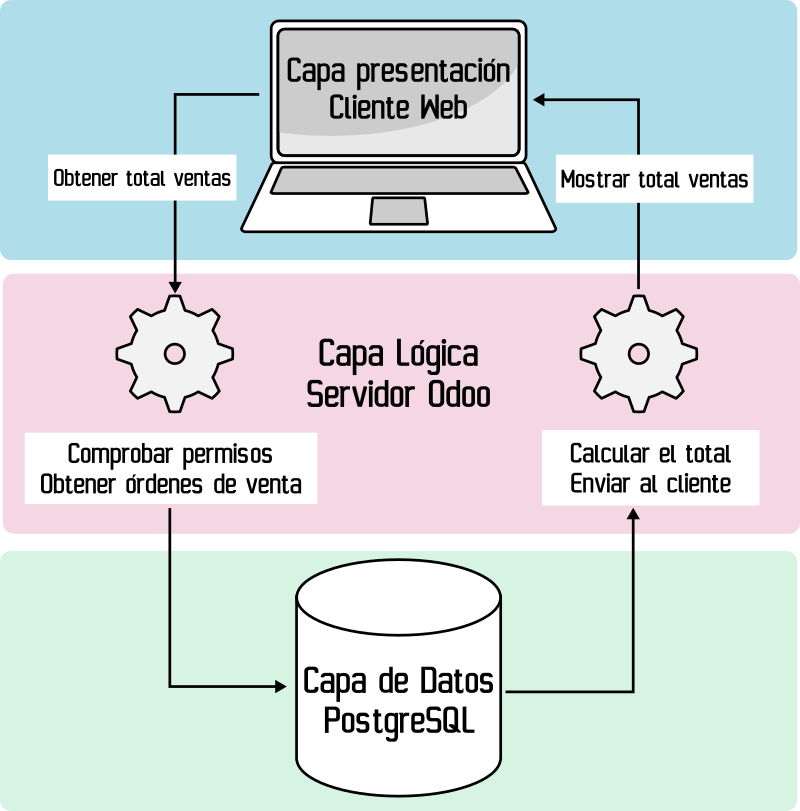

[TOC]

## 1. INTRODUCCIÓ
Odoo és un ERP-CRM de codi obert que es distribueix sota dos tipus de desplegament:

- On-premise en GNU/Linux o Windows amb dues versions (Community, gratuïta i Enterprise, de pagament).
- SaaS (Programari As A Service): l’empresa que desenvolupa Odoo també proporciona el seu servei en el núvol. 

D'aquesta manera, una empresa pot tenir el seu propi Odoo en un servidor local, en un núvol propi o en un núvol de tercers. També pot tenir accés a Odoo pel SaaS d'Odoo o d'altres terceres empreses que proporcionen Odoo com SaaS.

La llicència d'Odoo ha anat canviant al llarg del temps. La llicència actual, de la versió 18 'Community' és LGPLv3.

Odoo té una arquitectura “client-servidor” de 3 capes:

- La base de dades en un servidor PostgreSQL.
- El servidor Odoo, que engloba la lògica de negoci i el servidor web.
- La capa de client que és un SPA (Single Page Application). La capa client està dividida en almenys 3 interfícies molt diferenciades:
    - El “Backend” on s'administra la base de dades per part dels administradors i empleats de l'empresa.
    - El “Frontend” o pàgina web, on poden accedir els clients i empleats. Pot incloure una botiga i altres aplicacions.
    - El “TPV” per als terminals punt de venda que poden ser tàctils.

> 💬 **Atenció**: a més d'usar el seu propi client, Odoo admet que altres aplicacions interactuen amb el seu servidor usant XML-RPC. També es poden desenvolupar “web controllers” per a crear una API per a aplicacions web o mòbils, per exemple.

A part de l'arquitectura de 3 capes, Odoo és un sistema modular. Això vol dir que es pot ampliar amb mòduls de tercers (oficials o no) i mòduls desenvolupats per nosaltres mateixos.

De fet, en Odoo hi ha un mòdul “base” que conté el funcionament bàsic del servidor i a partir d'ací es carreguen tots els altres mòduls.

Quan instal·lem Odoo, abans d'instal·lar cap mòdul, tenim accés al “backend” on gestionar poc més que les opcions i usuaris. És necessari instal·lar els mòduls necessaris per a un funcionament mínim. Per exemple, el més típic és instal·lar almenys els mòduls de vendes, compres, CRM i comptabilitat.

Per a ampliar les funcionalitats o adaptar Odoo a les necessitats d'una empresa, no cal modificar el codi font d'Odoo. Tan sols necessitem crear un mòdul.

Els **mòduls d'Odoo** poden modificar el comportament del programa, l'estructura de la base de dades i/o la interfície d'usuari. En principi, un mòdul es pot instal·lar i desinstal·lar i els canvis que implicava el mòdul es reverteixen completament.


Odoo facilita el desenvolupament de mòduls perquè, a més d'un ERP, és un framework de programació. Odoo té el seu propi framework tipus **RAD (Rapid Application Development)**. Això significa que amb poc esforç es poden aconseguir aplicacions amb altes prestacions i segures.

>❕**Atenció**: el poc esforç és relatiu. Per a desenvolupar correctament en Odoo són necessaris amplis coneixements de Python, XML, HTML, Javascript i altres tecnologies associades com QWeb, JQuery, XML-RPC, etc. La corba d'aprenentatge és alta i la documentació és escassa. A més, els errors són més difícils d'interpretar perquè no sabem tot el que està passant per davall. La frustració inicial es veurà compensada amb una major agilitat i menys errors.

Aquest framework es basa en alguns dels principis generals dels RAD moderns:

- La capa **ORM (Object Relational Mapping)** entre els objectes i la base de dades.
    - La combinació **Classe Python ↔ ORM ↔ Tabla PostgreSQL** es coneix com a **Model**.
    - El programador no efectua el disseny de la base de dades, només de les classes i les seues relacions.
    - Tampoc és necessari fer consultes SQL, quasi tot es pot fer amb els mètodes d'ORM d'Odoo.
- L’arquitectura **MVC** (Modelo-Vista-Controlador).
    - El model es programa declarant classes de Python que hereten de “**models.Model**”. Aquesta herència provoca que actue l'ORM i és mapejen en la base de dades.
    - Les vistes es defineixen normalment en arxius XML i són llistes, formularis, calendaris, gràfics, menús, etc. Aquest XML serà enviat al client web on el framework Javascript d'Odoo ho transforma en HTML.
    - El controlador també es defineix en fitxers Python, normalment al costat del model. El controlador són els mètodes que proporcionen la lògica de negoci.
- Odoo té una arquitectura de **Tinença Múltiple**. De manera que un únic servidor pot proporcionar servei a molts clients de bases de dades diferents.
- Odoo proporciona un dissenyador d'informes.
- El framework facilita la traducció de l'aplicació a molts idiomes.

> 📖 **Important**: ja que Odoo facilita la traducció, és una bona pràctica programar tot en anglés, tant el nom de les variables com els textos que vam mostrar als usuaris. Posteriorment, podem afegir les traduccions necessàries.


## 2 La base de dades d'Odoo

Gràcies a l'ORM, no hi ha un disseny definit de la base de dades. La base de dades d'una empresa pot tenir algunes taules molt diferents d’altres en funció del mapatge que l'ORM haja fet amb les classes actives en aquesta empresa. Per tant, és difícil trobar un disseny “entitat-relació” o una cosa similar en la documentació d'Odoo.

Cal afegir que Odoo té alguns models ja creats i ben documentats com:
- “res.partner” (clients, proveïdors, etc.).
    - https://www.technaureus.com/odoo-partner-res-partner-concept/
- “sale.order” (Ordre de venda).

Aquests models existeixen de base pel fet que estan en quasi totes les empreses i versions d'Odoo.

Però ni tan sols aquests tenen en la base de dades les mateixes columnes o relacions que en altres empreses. Moltes vegades necessitem saber el nom del model, del camp o de la taula en la base de dades. Per a això, Odoo proporciona en el seu “backend” el “mode desenvolupador” per a saber el model i camp posant el ratolí damunt d'un camp dels formularis.

> 📖 **Important**: el nom de les classes de Python sempre ha de ser en minúscula i amb el  punt per a separar per jerarquia. El nom d'un model, per tant, serà  sempre: “modul.model”. Si el model té un nom compost, se separa per “_”.

> En la base de dades, el punt se substitueix per una barra baixa.


> 💬 **Interessant**: aconsellem dedicar uns minuts a conéixer la base de dades usant el “mode  desenvolupador” i el client de terminal de PostgreSQL. Per a això, podem repassar les consultes SQL traient, per exemple, el nom dels clients  que no han fet cap comanda.

## 3. Composició d'un mòdul

Odoo és un programa modular. Tant el servidor com el client es componen de mòduls que estenen al mòdul “base”. Qualsevol cosa que es vulga modificar en Odoo s'ha de fer creant un mòdul.

>📖 **Important:** ja que Odoo és de codi obert i tot el codi està en Python, que no és un llenguatge compilat, podem alterar els fitxers Python o XML dels mòduls oficials, canviant el que ens interesse.

>**Això pot funcionar, però és una mala pràctica, ja que:**

>\- Qualsevol actualització dels mòduls oficials esborraria els nostres canvis.

>\- Si no actualitzem, perdrem accés a nova funcionalitats i estarem exposats a problemes de seguretat.

>\- Revertir canvis és més difícil i la solució sol passar per tornar a la versió oficial.

Podem crear mòduls per a modificar, eliminar o ampliar parts d'altres mòduls. També podem crear mòduls per a afegir funcionalitats completament noves a Odoo sense interferir amb la resta del programa. En qualsevol cas, el sistema modular està dissenyat perquè es puguen instal·lar i desinstal·lar mòduls sense afectar la resta del programa.

**Exemple**: pot ser que una empresa no necessite totes les dades que demana Odoo en registrar un producte. Com a solució, podem fer un mòdul que elimine de la vista els camps innecessaris. Si després es comprova que aquells camps eren necessaris, només cal desinstal·lar el mòdul i tornen a aparéixer.

Aquest sistema modular funciona perquè, cada vegada que es reinicia el servidor o s'actualitza un mòdul, s'interpreten els fitxers Python que defineixen els models i l'ORM mapeja les novetats en la base de dades. A més, es carreguen les dades dels fitxers XML en la base de dades i s'actualitzen les dades que han canviat.

### 3.1 Estructura d'un mòdul

Els mòduls modifiquen parts de Model-Vista-Controlador. D'aquesta manera, un mòdul es compon de fitxers Python, XML, CSS o Javascript entre altres. Tots aquests arxius han d'estar en una carpeta amb el nom del mòdul.


Hi ha una estructura de subcarpetes i de noms d'arxius que quasi tots els mòduls respecten. Però tot depén del que pose en el fitxer “**__manifest__.py”**. Aquest fitxer conté un diccionari de Python amb informació del mòdul i la ubicació dels altres fitxers. A més, l'arxiu “**__init__.py**” indica quins fitxers Python s'han d'importar.


Dins d'un mòdul podem trobar:

- Fitxers Python que defineixen els models i els controladors.
- Fitxers XML que defineixen dades que han d'anar a la base de dades. Dins d'aquestes dades, podem trobar:
    - Definició de les vistes i les accions.
    - Dades de demo.
    - Dades estàtiques que necessita el mòdul.
- Fitxers estàtics com a imatges, CSS, Javascript, etc. que han de ser carregats per la interfície web.
- Controladors web per a gestionar les peticions web.

Els mòduls es guarden en un directori indicat en l'opció “**--addons-path**” en llançar el servidor o en el fitxer de configuració “**odoo.conf**”. Els mòduls poden estar en més d'un directori i depenen de la mena d'instal·lació o la distribució o versió que s'instal·le.


Per a crear un mòdul es pot fer manualment creat la carpeta, el manifest, els directoris i fitxers o utilitzant una eina de línia de comandos anomenada “**odoo scaffold**”.

> odoo scaffold nom_del_modul /ruta_don_colocarlo

Una vegada executat aquest comando, tenim en la ruta indicada, l'estructura bàsica de directoris i fitxers amb una mica de codi d'exemple.

> ❕**Atenció:** encara que usar “scaffold” ens proporciona una base, durant la unitat pot ser bona idea basar-se en exemples proporcionats a classe.

## 4.  Models

## 4.1 Introducció als models en Odoo

Els models són una abstracció pròpia de molts frameworks i relacionada amb l'ORM. Un model es defineix com una classe Python que hereta de la classe “**models.Model**”. En heretar d'aquesta classe, adquireix unes propietats de manera transparent per al programador. A partir d'aquest moment, les classes del llenguatge de programació queden per davall d'un nivell més d'abstracció.

Una classe heretada de “models.Model” es comporta de la següent manera:

- Pot ser accedida com a model, com “recordset” (conjunt de registres) o com “singleton” (un unic registre). Si és accedida com a model, té mètodes de model per a crear “recordsets”, per exemple. Si és accedida com “recordset”, es pot accedir a les dades que guarda.
- Pot tenir atributs interns de la classe, ja que continua sent Python. Però els atributs que es guarden en la base de dades s'han de definir com “fields”. Un “field” és una instància de la classe “fields.Field”, i té els seus propis atributs i funcions.
    - Odoo analitzarà el model, cercarà els atributs tipus “field” i les seues propietats i mapeará automàticament tot això en l'ORM.
- Els mètodes definits per als “recordset” reben un argument anomenat “self” que pot ser un “recordset” amb una col·lecció de registres. Per tant, han d'iterar en el self per a fer la seua funció en cadascun dels registres.
- Un model representa a la taula sencera en la base de dades. Un “recordset” representa a una col·lecció de registres d'aqueixa taula i també al model. Un “singleton” és un “recordset” d'un sol element.
- Els models tenen les seues pròpies funcions per a no haver d'accedir a la base de dades per a modificar o crear registres. A més, incorporen restriccions d'integritat.

Aquest és l'exemple d'un model amb solament un “field”:


Sobre el codi anterior, vegem detalladament tot el que passa:

- Es defineix una classe de Python que hereta de “**models.Model**”
- Es defineixen dos atributs “**_name**” i “**_description**”. El “**_name**” és obligatori en els models i és el nom del model. Ací s'observa l'abstracció, ja no s'accedirà a la classe “**Amodel**”, sinó al model “**a.model**”.
- Després està la definició d'un altre atribut tipus “**field**” que serà mapatge per l'ORM en la base de dades. Com es pot observar, crida al constructor de la classe “**fields.Char**” amb uns arguments. Tots els arguments són opcionals en el cas de “**Char**”. Hi ha constructors per a tots els tipus de dades.

> 💬 **Interessant**: és molt probable que a hores d'ara no entengues el perquè de la majoria  del codi anterior. Els frameworks requereixen entendre moltes coses  abans de poder començar. No obstant això, amb aquest fragment de codi ja tenim solucionat l'emmagatzematge en la base de dades, la integritat de les dades i part de la interacció amb l'usuari.

> 💬 **Interessant**: Odoo està pensat perquè siga fàcilment modificable per la web. Sense  necessitat d'entrar al codi. Això és molt útil per a prototipar les  vistes, per exemple.
> Una de les  funcionalitats és la manera desenvolupador, que permet, entre moltes  altres coses, explorar els models que té en aquest moment el servidor. 

Els models tenen alguns atributs del model, com “**_name**” o “**_description**”. Un altre atribut de model important és “**_rec_name**” que indica que atribut pren nom el registre i que per defecte apunta a l'atribut “name” (no confondre amb “_name”).

- En les vistes (que veurem més endavant), en alguns camps es basa en l'atribut marcat per “**_rec_name**”, que per defecte és “**name**”. Si no tenim un atribut “name” o volem que siga un altre atribut el que de nom, podem modificar-ho amb “**_rec_name=’nomatribut**’”.


 ### 4.2 Atributs tipus “field” simples

Els models tenen altres atributs tipus “field”, que es mapejen en la base  de dades i als quals l'usuari té accés i mètodes que conformen el  controlador. A continuació detallarem tots els tipus de “field” que hi  ha i les seues possibilitats:

En primer lloc, definim els “fields” de dades més habituals:

- **Integer**
- **Char**
- **Text**
- **Date**
- **Datetime**
- **Float**
- **Boolean**
- **Html**
- **Binary**: arxius binaris que guarda en format base64. Poden guardar-se imatges o  altres elements. Abans d'Odoo 13 en aquest tipus de “fields” es  guardaven les imatges.

Dins dels “fields” de dades, hi ha alguns una mica més complexos:

- **Image**: a partir de la versió 13 d'Odoo es poden guardar imatges en aquest  “field”. Cal definir el “max_width” o “max_height” i es redimensionarà  en guardar. 
- **Selection**: guarda una dada, però cal dir-li amb una llista de tuples les opcions que té.

Ací un exemple de “Selection”:

```python
type = fields.Selection([('1','Basic'),('2','Intermediate'),('3','Completed')]) 

aselection = fields.Selection(selection='a_function_name') # se puede definir su contenido en una función.
```

Tots els “fields” esmentats tenen un constructor que funciona de la mateixa  manera que en l'exemple anterior. Poden tenir un nom, un valor per  defecte, o fins i tot pot definir-se el seu contingut mitjançant una  funció.

Al llarg d'aquest text es veuran exemples de com s'han definit “fields” segons les necessitats.

### 4.3 Atributs “fields” relacionals

A continuació, observarem els “fields” relacionals. Atés que l'ORM evita  que hàgem de crear les taules i les seues relacions en la base de dades, quan existeixen relacions entre models es necessiten uns camps que  definisquen aquelles relacions.


**Exemple**: una comanda de venda té un client i un client pot fer moltes comandes de  venda. Al seu torn, aquesta comanda té moltes línies de comanda, que són només d’aquesta comanda i tenen un producte, que pot estar en moltes  línies de venda.


En situacions com la de l'exemple, aquestes relacions acaben estant en la  base de dades amb claus alienes. Però amb els frameworks que implementen ORM, tot això és molt més senzill.

Per a això utilitzarem els “fields” relacionals d'Odoo:

- **Many2one**: és el més simple. Indica que el model en el qual està té una relació  molts a un amb un altre model. Això significa que un registre té relació amb un únic registre de l'altre model, mentre que l'altre registre pot  tenir relació amb molts registres del model que té el “Many2one”. En la  taula de la base de dades, això es traduirà en una clau aliena a l'altra taula.
    - Exemple on es pretén que cada ciutat emmagatzeme el seu país.
    

- Les de “alumnes amb mòduls”, descrita en l'exemple anterior.
- Una nova relació, on es relacionen alumnes repetidors amb mòduls pendents.

No han de coincidir, però si no s'especifica una taula intermèdia diferent, **Odoo considerarà que és la mateixa relació**. En aquests casos cal especificar la taula intermèdia amb la sintaxi completa per a evitar errors:

```python
alumnos_ids = fields.Many2many(comodel_name='modulo.alumno',
relation='modulos_alumnos', # El nombre de la tabla intermedia
column1='modulo_id', # El nombre en la tabla intermedia de la clave a este modelo
column2='alumno_id')  # El nombre de la clave al otro modelo.
repetidores_ids = fields.Many2many(comodel_name='modulo.alumno',
relation='modulos_alumnos_repetidores', # El nombre de la tabla intermedia
column1='modulo_id', # El nombre en la tabla intermedia de la clave a este modelo
column2='alumno_id')  # El nombre de la clave al otro modelo.
modulos_ids = field.Many2many(comodel_name='modulo.modulo',
relation='modulos_alumnos', # El nombre de la tabla intermedia
column1='alumno_id', # El nombre en la tabla intermedia de la clave a este modelo
column2='modulo_id')  # El nombre de la clave al otro modelo.
pendientes_ids = field.Many2many(comodel_name='modulo.modulo',
relation='modulos_alumnos_repetidores', # El nombre de la tabla intermedia
column1='alumno_id', # El nombre en la tabla intermedia de la clave a este modelo
column2='modulo_id')  # El nombre de la clave al otro modelo.
```

Les relacions “Many2one”, “One2many” i “Many2many” suposen la majoria de les relacions necessàries en qualsevol programa. Hi ha un altre tipus de “fields” relacionals especials que faciliten la programació:
- **related**: en realitat no és un tipus de “field”, sinó una possible propietat de qualsevol dels tipus. El que fa un “field related” és mostrar una dada que està en un registre d'un altre model amb el qual es té una relació “Many2one”.

Si prenem com a exemple l'anterior de les ciutats i països, imaginem que volem mostrar la bandera del país en el qual està la ciutat. La bandera serà un camp “Image” que estarà en el model país, però el volem mostrar també en el model ciutat. Per a això tenim dues possibles solucions:
- La solució dolenta seria guardar la bandera en cada ciutat.

- La bona solució és usar un “field related” per a accedir a la bandera.

  ```python
  pais_id = fields.Many2one('modulo.pais') # Esto en el modelo Ciudad
  bandera = fields.Image(related='pais_id.bandera') # Suponiendo que existe el field bandera y es de tipo Image.
  ```

  

>📖 **Important**: el “field related” pot tenir 'store=True' si volem que ho guarde en la base de dades. En la majoria de casos és redundant i no serveix. Però pot ser que per raons de rendiment, o per a poder cercar, s'haja de guardar. Això no respecta la tercera forma normal. En aqueix cas, Odoo s'encarrega de mantenir la coherència de les dades. 

>📖 **Important**: un altre ús possible dels “field related” pot ser fer referència a “fields” del propi model per a tenir les dades repetides. Això és molt útil en les imatges, per exemple, per a emmagatzemar versions amb diferents resolucions. També pot ser útil per a mostrar els mateixos “fields” amb diversos “widgets”.

- **Reference**: és una referència a un camp arbitrari d'un model. En realitat no provoca una relació en la base de dades. El que guarda és el nom del model i del camp en un “field char”.
- **Many2oneReference**: és un “Many2one” però en el qual també cal indicar el model al qual fa referència. No són molt utilitzats.

> 💬 **Interessant**: en algunes ocasions, influïts pel pensament de les bases de dades relacionals, podem decidir que necessitem una relació **“One2one”. Odoo va deixar d'usar-les per motius de rendiment i recomana en el seu lloc unir els dos models en un**. No obstant això, es pot imitar amb dos “Many2many” computats o un “One2many” limitat a un sol registre. En els dos casos, serà tasca del programador garantir el bon funcionament d'aqueixa relació.

Una vegada estudiat el concepte de model i dels 'fields', detinguem-nos un moment a analitzar aquest codi que defineix 2 models:

```python
# -*- coding: utf-8 -*-
from odoo import models, fields, api
from openerp.exceptions import ValidationError
class net(models.Model):
    _name = 'networks.net'
    _description = 'Networks Model'
    name = fields.Char()
    net_ip = fields.Char()
    mask = fields.Integer()
    net_map = fields.image()
    net_class = fields.Selection([('a','A'),('b','B'),('c','C')])
    pcs = fields.One2many('networks.pc','net')
    servers = fields.Many2many('networks.pc',relation='net_servers')              
class pc(models.Model):
    _name = 'networks.pc'
    _description = 'PCs Model'
    name = fields.Char(default="PC")
    number = fields.Integer()
    ip = fields.Char()
    ping = fields.Float()
    registered = fields.Date()
    uptime = fields.Datetime()
    net = fields.Many2one('networks.net')
    user = fields.Many2one('res.partner')
    servers = fields.Many2many('networks.net',relation='net_servers')
```

Com es pot veure, estan quasi tots els tipus bàsics de field. També podem veure fields relacionals. Parem atenció al “Many2one” anomentat “net” dels “PC” que permet que funcione l'”One2many” anomenat “pcs” del model “networks.net”. També són interessants els “Many2many” en els quals declarem el nom de la relació per a controlar el nom de la taula intermèdia.

Una vegada repassats els tipus de fields i vist un exemple, ja podríem fer un mòdul amb dades estàtiques i relacions entre els models. Ens faltaria la vista per a poder veure aquests models en el client web. Pots passar directament a l'apartat de la vista si vols tenir un mòdul funcional mínim. Però en el model queden algunes coses que explicar.

